# Signal Representation

This practical class reviews some of the possible representations of a signal both in the time domain and in the frequency domain. All of the practical classes will take advantage of the Python programming language to study and model signal converters. The Jupyter Notebooks are a great way to segment the developed code, enabling an easier debugging and learning experience. The Jupyter Notebooks also enable the introduction of Markdown latex HTML notes in the middle of the code cells, offering a truly complete note-taking environment.


```python
import numpy as np
import matplotlib.pyplot as plt

import scienceplots

plt.style.use(['science', 'notebook'])

%matplotlib inline
```

## Signal Representation in the Time-Domain

<p align="justify"> This section covers some nuances of the represenation of a signal (voltage/current/code) in the time-domain, throughout an independent axis representing time. Two main aspects of the representation of a signal are presented:
<ul>
<li>1- A signal can be decomposed on an infinite sum of fundamental trigonometric functions (sine and cosine), according to Fourier's Signal Theory;</li>
<li>2- The importance of using a differential signal chain is analysed to observe its impact on the overall distortion of the output signal.</li>
</ul>
</p>


```python
# define the number of points for the simulation
# NOTE: This enables a better control of the simulation time and memmory resources 
Np = 1001
# define time base
Fs = 100e3
Ts = 1/Fs
tD = np.arange(0,Np)*Ts; # (0:Np-1) == np.arange(0,Np)
tD

```


```python
# define the signals
Amp1 = 1
f1 = 1e3
phase1 = 0
phase1_rad = np.deg2rad(phase1)
x1 = Amp1*np.sin(2*np.pi*f1*tD + phase1_rad)
x1
```


```python
# visualize the signals
fig, ax = plt.subplots(1,1, figsize = (10,4))
ax.plot(tD, x1, lw = 2, ls="-", color='b', ms=3)
ax.grid(True)
ax.set_ylabel("Voltage (V)")
ax.set_xlabel("Time (s)")
ax.legend()
plt.show()
```

    
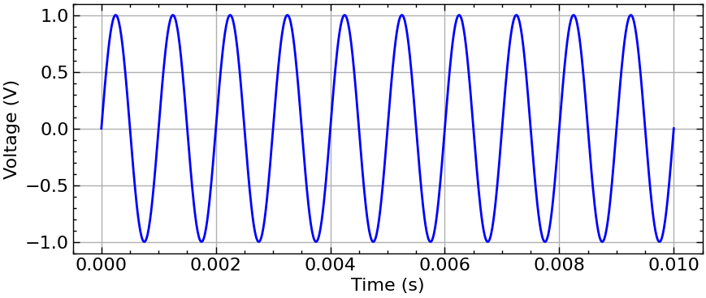
    

```python
# changing the frequency of the signal
# define the new signal
Amp2 = 1
f2 = 0.5e3
phase2 = 0
phase2_rad = np.deg2rad(phase1)
x2 = Amp2*np.sin(2*np.pi*f2*tD + phase1_rad)
x2
```


```python
# visualize the signals
fig, ax = plt.subplots(1,1, figsize = (10,4))
ax.plot(tD, x2, lw = 2, ls="-", color="r", ms=3)
ax.grid(True)
ax.set_ylabel("Voltage (V)")
ax.set_xlabel("Time (s)")
ax.legend()
plt.show()
```  

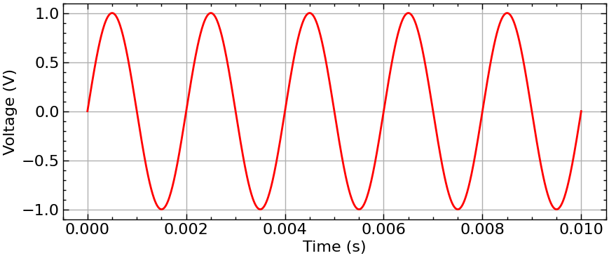  


```python
# observing 2 sinusoids in the same plot
# second harmonic 
Amp2 = 0.5
f2 = 2e3
phase2_rad = np.deg2rad(0)
x2 = Amp2*np.sin(2*np.pi*f2*tD + phase2_rad)
# third harmonic
Amp3 = 0.2
f3 = 3e3
phase3_rad = np.deg2rad(0)
x3 = Amp3*np.sin(2*np.pi*f3*tD + phase3_rad)
```

Visualize the signals and infer on the veracity of the Fourier Series 
representation of the signal - any signal can be represented as a sum of sinusoids!
In this case, the sum of x1 with x3 can almost generate a digital signal denominated as a square wave.


```python

fig, ax = plt.subplots(3,1, figsize = (10,10))
ax[0].plot(tD, x1, lw = 2, ls="-", color="b", marker="None", ms=3, label="x1")
ax[0].plot(tD, x2, lw = 2, ls="-", color="g", marker="None", ms=3, label="x2")
ax[0].plot(tD, x3, lw = 2, ls="-", color="r", marker="None", ms=3, label="x3")
ax[0].set_title("x1(t), x3(t)")
ax[0].legend(frameon=True, facecolor="pink", edgecolor="none")
ax[0].grid(True)
ax[0].set_ylabel("Voltage (V)")
ax[1].plot(tD, x1+x2, lw = 2, ls="-", color="k", marker="None", ms=3)
ax[1].set_title("x1(t) + x2(t)")
ax[1].grid(True)
ax[1].set_ylabel("Voltage (V)")
ax[2].plot(tD, x1+x3, lw = 2, ls="-", color="k", marker="None", ms=3)
ax[2].set_title("x1(t) + x3(t)")
ax[2].grid(True)
ax[2].set_ylabel("Voltage (V)")
ax[2].set_xlabel("Time (s)")
fig.tight_layout()
plt.show()
```


    
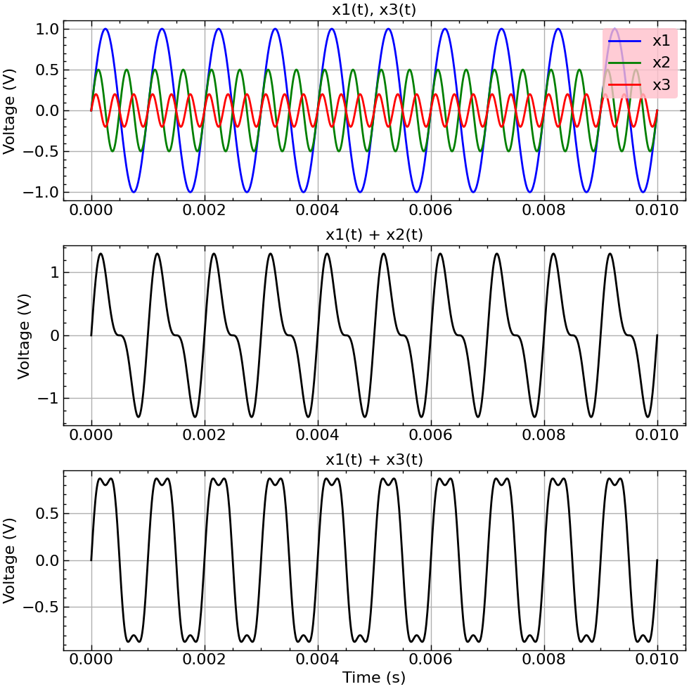
    


<p align="justify">
From the above signal representations, two conclusions can be made:
<ul>
<li>The odd harmonics allow to preserve the area ratio of the positive wave and negative wave of the signal in relation to the average value.In other words, the odd harmonics allow the signal to preserve its symmetry.
</li> 
<li>The same is not true for the even harmonics. The even harmonics do not ensure that the signal preserves its symmetry in relation to its average value.
</li>
</ul>
</p>

<p align="justify">
Any signal processing chain, or signal conversion chain should always be differential, in which the processed signals feature a phase of 180 º between each other. Differential signals enable the natural cancellation of the even harmonic components of the signal, significantly improving the linearity of the signal at the output of the signal processign chain.
</p>

Demo:
<p align="justify">Given the signal: </p> 

$$s(t) = a_1 *sin(2\pi f_1t + \phi_1) + [a_2 *sin(2\pi f_1t + \phi_2)]^2 + [a_3 *sin(2\pi f_1t + \phi_3)]^3$$

where: $f_2 = 2f_1$ and $f_3=3f_1$

The differential rendition of this signal would give us:

$$s(t) - s(t+180º) = 2a_1*sin(2\pi f_1t + \phi_1) + \frac{4a_3^2}{3}*sin(2\pi 3f_1t + \phi_3) + s_{DC}$$

<p align="justify">
As it is possible to observe, the even harmonic components are cancelled, and thus the distortion is reduced.
</p>

---

## Signal Representation in the Frequency-Domain

<p align="justify"> 
This section covers the representation of the signals defined in the previous section in the frequency domain. The signal representation defined by Fourier's series holds true in the frequency spectrum. A depiction of this is the representation of the sum of the x1, x2 and x3 signals in the frequency spectrum, featuring the resulting three dirac distributions. The frequencies of these distributions correspond to the fundamental, second and third harmonics of the signal resulting from the sum of the signals.
</p>


```python
# spectral analysis using fft - fast fourier transform
yt = x1+x2+x3
yf = np.abs(np.fft.fftshift(np.fft.fft(yt) / Np))  # [V] # voltage in the frequency axis
# NOTE: fft(yf) is divided by Np in order to normalize the resulting frequency spectrum from the digital fourier transform
fD = np.fft.fftshift(np.fft.fftfreq(Np, Ts))  # [Hz] # frequency axis
power_yf = (yf*yf) # [V^2] - square the voltage spectrum to obtain the power spectrum
power_yf_dB = 10 * np.log10(power_yf)  # [dB] - convert the power spectrum to dB
power_yf_dB

yf2 = np.abs(np.fft.fftshift(np.fft.fft(x1) / Np))  # [V] # voltage in the frequency axis
# NOTE: fft(yf) is divided by Np in order to normalize the resulting frequency spectrum from the digital fourier transform
power_yf2 = (yf2*yf2) # [V^2] - square the voltage spectrum to obtain the power spectrum
power_yf2_dB = 10 * np.log10(power_yf2)  # [dB] - convert the power spectrum to dB
```


```python
# plot the frequency spectrum
fig, ax = plt.subplots(2,1, figsize=(10,5))
f_scale = 1e3# frequency scale [Hz]
p_scale = 1 # power scale in [dB]
ax[0].stem(
    fD[fD>=0] / f_scale,
    power_yf_dB[fD>=0] / p_scale,
    bottom=np.min(power_yf_dB / p_scale),
    #use_line_collection=True,
    linefmt="b-",
    markerfmt="none",
    basefmt="r-",
)
ax[0].set_xlabel("Frequency (KHz)")
ax[0].set_ylabel("Power (dB)")
ax[0].set_title("Frequency spectrum of x1+x2+x3")
f_lim = 4e3/f_scale # limitting frequency
ax[0].set_xlim([0, f_lim])
ax[0].set_ylim([-40, 0])
ax[1].plot(
    fD[fD>=0] / f_scale,
    power_yf2_dB[fD>=0] / p_scale,
    ls="-",
    color="k",
    marker="none"
)
ax[1].set_xlabel("Frequency (KHz)")
ax[1].set_ylabel("Power (dB)")
ax[1].set_xlim([0, f_lim])
fig.tight_layout()
```


    
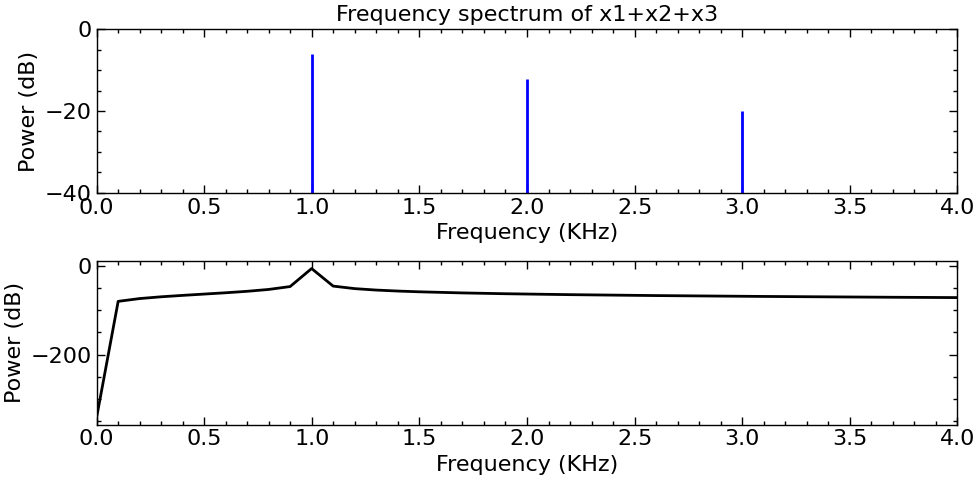
    


<p align="justify">
As it is possible to observe, the plot of x1 in black (the second curve) gives us a spectral dirac that is not concentrated on a single frequency bin, and rather spreads throughout the frequency with decreasing power throughout the spectrum.
</p>

### One possible solution: Windows!

<p align="justify">
The use of a window defining the simulation time window in which the spectrum of the signal will be analysed can significantly improve the spectral quality of the observed signal in the frequency spectrum. The following example uses a Blackman-Harris window, multiplying it to the signal in the time-domain. As such, the obtained signal's frequency spectrum features a much more perceptible definition of the central frequency of each signal's harmonic. The resulting computed spectral power of each harmonic appears to be lower than the spectrum obtained without the use of a window. This is a mere appearance, and it results from the fact that the Blackman-Harris window causes the power of each harmonic to be spread throughout 5 frequency bins (2 bins before, the central bin of the harmonic and 2 bins after).
</p>

<p align="justify">NOTE: Another solution (which is actually preferred) would be to use coherent sampling - ensuring the sampling frequency is simultaneously a prime number and a multiple of the input signal's frequency. Both solutions can also be used simultaneously.</p>


```python
# applying a blackman harris window to
# better observe the signal's spectrum
from scipy import signal
window = signal.windows.blackmanharris(Np)
fig,ax = plt.subplots(1,figsize=(4,4))
ax.set_xlabel('Samples')
ax.set_ylabel('Window Amplitude')
plt.plot(window)
```
    
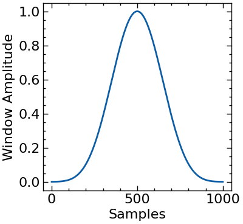
    

```python
# spectral analysis using fft - fast fourier transform
ytbm = yt*signal.windows.blackmanharris(Np)
yfbm = np.abs(np.fft.fftshift(np.fft.fft(ytbm) / Np))  # [V] # voltage in the frequency axis
# NOTE: fft(yf) is divided by Np in order to normalize the resulting frequency spectrum from the digital fourier transform
power_yfbm = (yfbm*yfbm) # [V^2] - square the voltage spectrum to obtain the power spectrum
power_yfbm_dB = 10 * np.log10(power_yfbm)  # [dB] - convert the power spectrum to dB
```


```python
# plot the frequency spectrum
fig, ax = plt.subplots(2,1, figsize=(10,5))
f_scale = 1e3# frequency scale [Hz]
p_scale = 1 # power scale in [dB]
ax[0].stem(
    fD[fD>=0] / f_scale,
    power_yf_dB[fD>=0] / p_scale,
    bottom=np.min(power_yf_dB / p_scale),
    #use_line_collection=True,
    linefmt="b-",
    markerfmt="none",
    basefmt="r-",
)
ax[0].set_xlabel("Frequency (KHz)")
ax[0].set_ylabel("Power (dB)")
ax[0].set_title("Frequency spectrum of x1+x2+x3")
f_lim = 4e3/f_scale # limitting frequency
ax[0].set_xlim([0, f_lim])
ax[0].set_ylim([-40, 0])
ax[1].plot(
    fD[fD>=0] / f_scale,
    power_yf_dB[fD>=0] / p_scale,
    ls="-",
    color="k",
    marker="none",
)
ax[1].plot(
    fD[fD>=0] / f_scale,
    power_yfbm_dB[fD>=0] / p_scale,
    ls="-",
    color="r",
    marker="none",
)
ax[1].set_xlabel("Frequency (KHz)")
ax[1].set_ylabel("Power (dB)")
ax[1].set_xlim([0, f_lim])
fig.tight_layout()
```


    
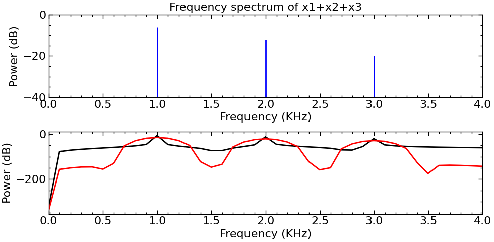
    


## Noise Sources and Representation

<p align="justify">
To perform a more accurate simulation of the signal converters that are going to be studied in this course, a superposition of noise to the processed signal is inevitable and required. The process of quantizing an ideal signal without any supperposed noise will inevitably add a quantization error to the signal, as seen in the following equation.
</p>

$$ s_Q(t) = s(t) + \epsilon_Q(t) \hspace{10pt} (1)$$

where $\epsilon_Q(t)$ is the quantization error, $s_Q(t)$ is the quantized signal and $s(t)$ is the processed signal.

<p align="justify">
However, in reality all analog signals are subject to some form of noise. If the processed signal features a given level of noise power superposed to it, and the signal converter/quantizer features an high-enough quantization precision, the quantization error can actually be well approximated by white noise, as seen in (2). White noise is present throughout all the spectrum of both the signal and the quantizing system. It features a constant power spectral density throughout the system's operation spectrum, and as such it is very easy to model through a uniform distribution.
</p>

$$s_Q(t) = (x(t) + n(t)) + \epsilon_Q(t) = x(t) + v_{NQ}(t) \hspace{10pt} (2)$$

where $x(t)$ is the processed signal, $n(t)$ is the noise superposed to the processed signal and $v_{NQ}(t)$ is the quantization white noise approximated by the sum of $n(t)$ and $\epsilon_Q(t)$.


```python
from numpy.random import normal, uniform # random numbers fitted into a normal or uniform distribution
import seaborn as sns # to observe the noise signal's histogram
# define the quantizer's main parameters
nbits = 4 # number of bits
vref = 0.9 # reference voltage [V]
vlsb = vref / (2**nbits) # fundamental step votlage of the quantizer [V]
# define the noise parameters
vqmean = 0 # quantizer's mean voltage [V]
vqvar = (vlsb**2)/12 # quantization noise variance  [V]
vqstddev = np.sqrt(vqvar) # quantization noise standard deviation (Vqrms) [V]
# generate the noise signal
vq = uniform(-vqstddev, vqstddev, Np) # quantization noise signal with a uniform dist (white noise)[V]
#sns.distplot(vq, bins=10, hist_kws={"edgecolor":"black"})
# frequency domain analysis of the white noise signal
vqf = np.abs(np.fft.fftshift(np.fft.fft(vq) / Np))  # [V] # voltage in the frequency axis
pqf = (vqf*vqf) # [V^2] - square the voltage spectrum to obtain the power spectrum
pqf_dB = 10 * np.log10(pqf)  # [dB] - convert the power spectrum to dB
# plot the frequency spectrum
# plot the noise signal in the time domain, frequency domain 
# and its histogram


fig, ax = plt.subplots(3,1, figsize=(10,10))
ax[0].plot(tD, vq, ls="-", color="k", marker="none")
ax[0].set_xlabel("Time (s)")
ax[0].set_ylabel("Voltage (V)")
ax[0].set_title("Quantization noise signal")
ax[1].plot( 
    fD[fD>=0] / f_scale, pqf_dB[fD>=0] / p_scale,
    ls="-", color="gray", marker="none")
ax[1].set_xlabel("Frequency (KHz)")
ax[1].set_ylabel("Power (dB)")
ax[1].set_title("Quantization noise signal's frequency spectrum")
sns.histplot(vq, ax=ax[2], color="gray")
ax[2].hlines(
    y=np.mean(np.histogram(vq, bins=10)[0]), 
    xmin=-vqstddev, xmax=vqstddev, color="r")
ax[2].set_xlabel("Voltage (V)")
ax[2].set_ylabel("Count")
ax[2].set_title("Quantization noise signal's histogram")
ax[0].grid()
ax[1].grid()
ax[2].grid(False)
fig.tight_layout()
```


    
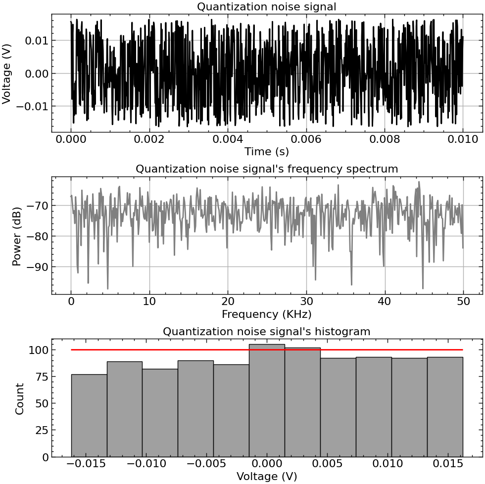
    


```python
# define the noise parameters
vqmean = 0 # quantizer's mean voltage [V]
vqvar = (vlsb**2)/12 # quantization noise variance  [V]
vqstddev = np.sqrt(vqvar) # quantization noise standard deviation (Vqrms) [V]
# generate the noise signal
vq = normal(vqmean, vqstddev, Np) # gaussian noise signal with a normal dist [V]
#sns.distplot(vq, bins=10, hist_kws={"edgecolor":"black"})
# frequency domain analysis of the white noise signal
vqf = np.abs(np.fft.fftshift(np.fft.fft(vq) / Np))  # [V] # voltage in the frequency axis
pqf = (vqf*vqf) # [V^2] - square the voltage spectrum to obtain the power spectrum
pqf_dB = 10 * np.log10(pqf)  # [dB] - convert the power spectrum to dB
# plot the frequency spectrum
# plot the noise signal in the time domain, frequency domain 
# and its histogram

#! OBSERVE A NOISE SIGNAL DEFINED USNG A NORMAL DISTRIBUTION
fig, ax = plt.subplots(3,1, figsize=(10,10))
ax[0].plot(tD, vq, ls="-", color="k", marker="none")
ax[0].set_xlabel("Time (s)")
ax[0].set_ylabel("Voltage (V)")
ax[0].set_title("Gaussian noise signal")
ax[1].plot( 
    fD[fD>=0] / f_scale, pqf_dB[fD>=0] / p_scale,
    ls="-", color="gray", marker="none")
ax[1].set_xlabel("Frequency (KHz)")
ax[1].set_ylabel("Power (dB)")
ax[1].set_title("Gaussian noise signal's frequency spectrum")
sns.histplot(vq, ax=ax[2], color="gray", edgecolor="gray", kde=True)
#ax[2].vlines(
#    x=np.mean(vq), 
#    ymin=0, ymax=np.mean(np.histogram(vq, bins=10)[0]), color="r")
ax[2].set_xlabel("Voltage (V)")
ax[2].set_ylabel("Count")
ax[2].set_title("Gaussian noise signal's histogram")
ax[0].grid()
ax[1].grid()
ax[2].grid(False)
fig.tight_layout()
```


    
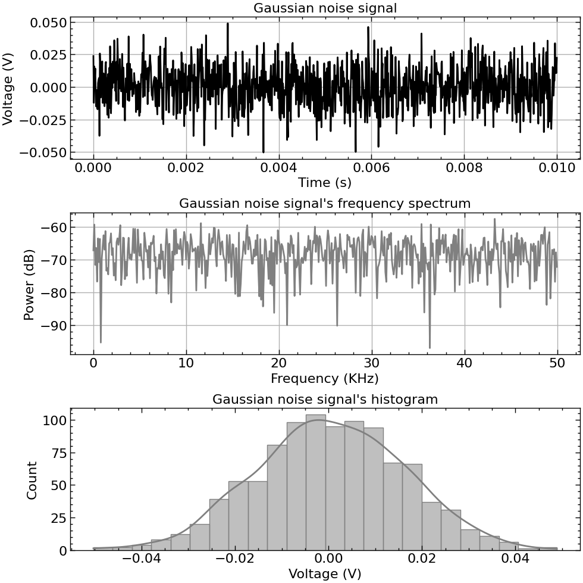
    


```python
# let us now superpose the noise signal to the x1 signal and observe 
# the resulting signal's frequency spectrum, histogram and time domain
Amp1 = 0.2 # amplitude of the sine wave [V]
x1 = Amp1*np.sin(2*np.pi*f1*tD + phase1_rad) # [V] - sine wave
vq = uniform(-vqstddev, vqstddev, Np) # quantization noise signal with a uniform dist (white noise)[V]
st = x1 + vq
stf = np.abs(np.fft.fftshift(np.fft.fft(st) / Np))  # [V] # voltage in the frequency axis
ptf = (stf*stf) # [V^2] - square the voltage spectrum to obtain the power spectrum
ptf_dB = 10 * np.log10(ptf)  # [dB] - convert the power spectrum to dB
# plot the frequency spectrum
# plot the noise signal in the time domain, frequency domain
# and its histogram
fig, ax = plt.subplots(3,1, figsize=(10,10))
ax[0].plot(tD, st, ls="-", color="k", marker="none")
ax[0].set_xlabel("Time (s)")
ax[0].set_ylabel("Voltage (V)")
ax[0].set_title(r"Quantized signal - $s(t)$")
ax[1].plot(
    fD[fD>=0] / f_scale, ptf_dB[fD>=0] / p_scale,
    ls="-", color="gray", marker="none")
ax[1].set_xlabel("Frequency (KHz)")
ax[1].set_ylabel("Power (dB)")
ax[1].set_title("Quantized signal's frequency spectrum")
sns.histplot(st, ax=ax[2], color="gray", kde=True)
ax[2].set_xlabel("Voltage (V)")
ax[2].set_ylabel("Count")
ax[2].set_title("Quantized signal's histogram")
ax[0].grid()
ax[1].grid()
ax[2].grid(False)
fig.tight_layout()
```


    
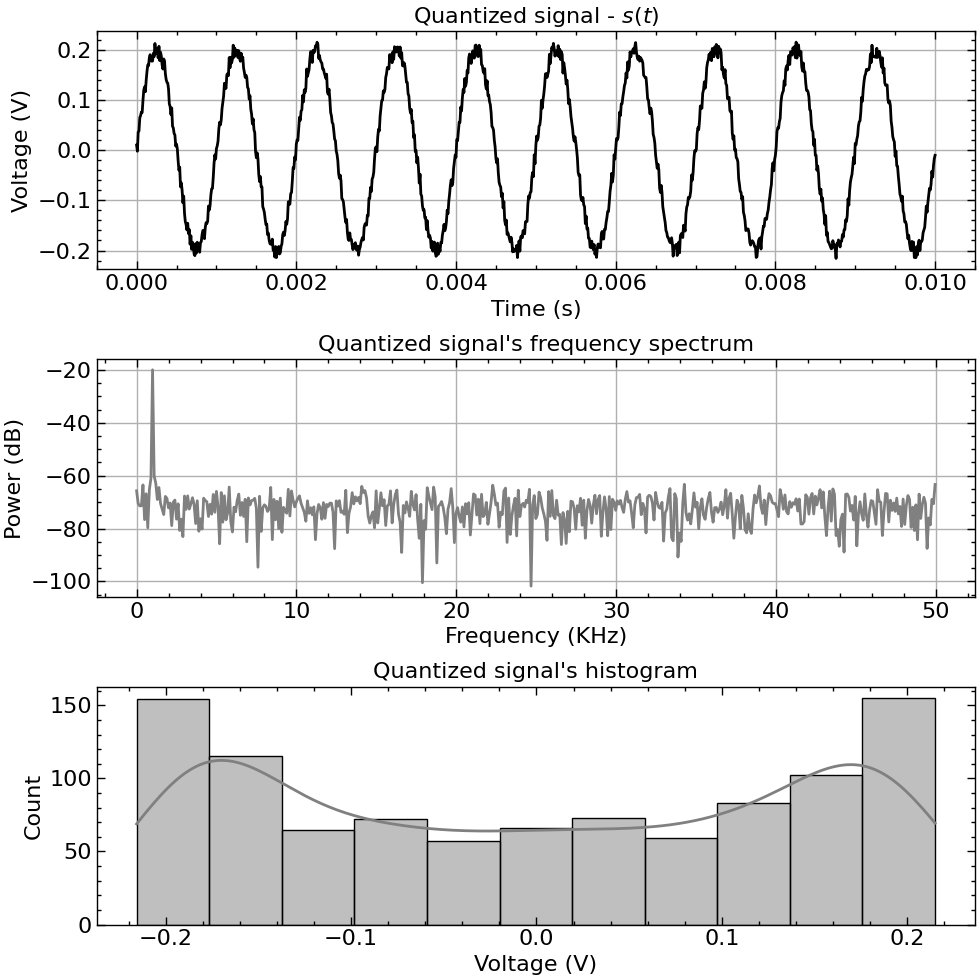

---  

# Ideal ADC and DAC modelling

<p align="justify">
The models of an ideal ADC and DAC biased with a Vref voltage and N bits of resolution are presented in this notebook. The covnersion functions of both converters were created using the lambda programming style. Using this style, the creator function for the ADC or DAC receives the 2 fundamental parameters defining these ideal electronic systems:
<ul>
<li>Vref - The reference/biasing voltage of the converter;</li>
<li>Nbits - the number of bits of the converter system (its digital resolution).</li>
</ul>
The converter then returns a function that depending on its input will generate an output code or voltage, for the ADC or DAC, respectively.
</p>


```python
from functools import reduce
import numpy as np
import matplotlib.pyplot as plt

import scienceplots

plt.style.use(['science', 'notebook'])

%matplotlib inline
```


```python


# define the function to convert a binary vector to decimal
def bin2dec(x, width):
    """Convert a numpy array from binary to decimal.
    IF the input is an array of binary arrays, 
    the returned output is an array of the corresponding 
    decimals in their corresponding indexes.
    Parameters:
        x: numpy array
        b: base of the number system
    """
    x = np.array(x)
    if x.size == width:
        assert len(x) == width, "The length of the vector must be equal to the number of bits"
        return reduce(lambda x,b: 2*x + b, x)
    assert len(x[0]) == width, "The length of the vector must be equal to the number of bits"
    return np.array(np.array([reduce(lambda xval,b: 2*xval + b, xval) for xval in x]))

def dec2bin(x, width):
    """Convert a numpy array from decimal to binary
    If the input is an array of decimals, the returned 
    binary arrays are the codes corresponding to 
    each decimal in its corresponding index.
    Parameters:
        x: numpy array
        b: base of the number system
    """
    x = np.array(x)
    if x.size == 1:
        return np.array([int(c) for c in np.binary_repr(x, width=width)])
    return np.array([np.array([int(c) for c in np.binary_repr(subx, width=width)]) for subx in x])

# test 
x = np.array([1,0,1,1,0,1])
assert bin2dec(x,6) == 45
x = np.array([1,0,1])
assert bin2dec(x,3) == 5
```

## Digital-to-Analog Converter Modelling

<p align="justify"> 
This section presents the definition of the ideal model for the 
transfer function of a DAC. The corresponding transfer function 
that is implemented through a lambda programming style can be observed
in (1). There are other possible solutions, such as using an 
object-oriented programming approach by defining a DAC object with 
a "convert" method.
</p>

$$V_{OUT}(D_{in}) = base_{10}\{D_{in}\}*V_{LSB}\hspace{10 pt} (1)$$

where $D_{in}$ is the input binary word of the DAC, $V_{LSB}$ is the Least Significant Bit step voltage and $V_{OUT}$ is the output voltage of the DAC.


```python
# Modelling an ideal Digital to Analog Converter (DAC)
vref = 5 # The biasing voltage of the DAC [V]
n_bits = 3 # The resolution of the ideal DAC
# define the ideal model of a DAC using lambda programming
def ideal_dac(vref:float, n_bits:int):
    """Define the transfer function of an ideal 
    DAC biased by vref and presenting an n_bits resolution.
    Parameters:
        vref (float): The biasing voltage of the electronic system.
        n_bits (int): The resolution of the DAC.
    Returns:
        function(Din): the lambda function defining the transfer function of the DAC
    """
    vlsb = vref/(2**n_bits) # compute the fundamental step voltage between quantized levels
    return lambda x: bin2dec(x, n_bits)*vlsb # return the converter funtion
```


```python
# define the DAC's transfer function
idac = ideal_dac(vref, n_bits)
# define the array of decimal input codes
# belonging to [0, 2^{n_bits}-1]
x = np.arange(2**n_bits)
print(x)
# convert the input codes array 
# from decimal to binary using arrays of 1s and 0s
x_bin = np.array([dec2bin(i, n_bits) for i in x])
# create the string representation of the binary words
x_bin_str = [ "".join([str(num) for num in xv]) for xv in x_bin]
print(x_bin)
print(idac(x_bin[1]))
# get the corresponding output voltages
# of the DAC for each corresponding input code
y = idac(x_bin)
# plot the transfer function of the ideal DAC
fig, ax = plt.subplots(2,1, figsize=(8,8))
ax[0].plot(x_bin_str, y, marker="o", mfc="None") # mfc == marker face color
ax[0].set_xticklabels(x_bin_str, rotation=45)
ax[0].set_yticks(y)
ax[0].set_xlabel('Code')
ax[0].set_ylabel('Voltage (V)')
ax[0].set_title('Ideal DAC Transfer Function (Vout(Din))')
ax[0].grid(True)
ax[1].step(x_bin_str, y, marker="None", color="k", label="floor", where="post")
# note that the step function of the DAC is always a post step!
ax[1].set_xticklabels(x_bin_str, rotation=45)
ax[1].set_yticks(y)
ax[1].set_xlabel('Code')
ax[1].set_ylabel('Voltage (V)')
ax[1].grid(True)
fig.tight_layout()
```

    [0 1 2 3 4 5 6 7]
    [[0 0 0]
     [0 0 1]
     [0 1 0]
     [0 1 1]
     [1 0 0]
     [1 0 1]
     [1 1 0]
     [1 1 1]]
    0.625


    /var/folders/vv/xctyh4bd2td6k2w_gvh_t2vr0000gn/T/ipykernel_26609/887913226.py:20: UserWarning: set_ticklabels() should only be used with a fixed number of ticks, i.e. after set_ticks() or using a FixedLocator.
      ax[0].set_xticklabels(x_bin_str, rotation=45)
    /var/folders/vv/xctyh4bd2td6k2w_gvh_t2vr0000gn/T/ipykernel_26609/887913226.py:28: UserWarning: set_ticklabels() should only be used with a fixed number of ticks, i.e. after set_ticks() or using a FixedLocator.
      ax[1].set_xticklabels(x_bin_str, rotation=45)


    
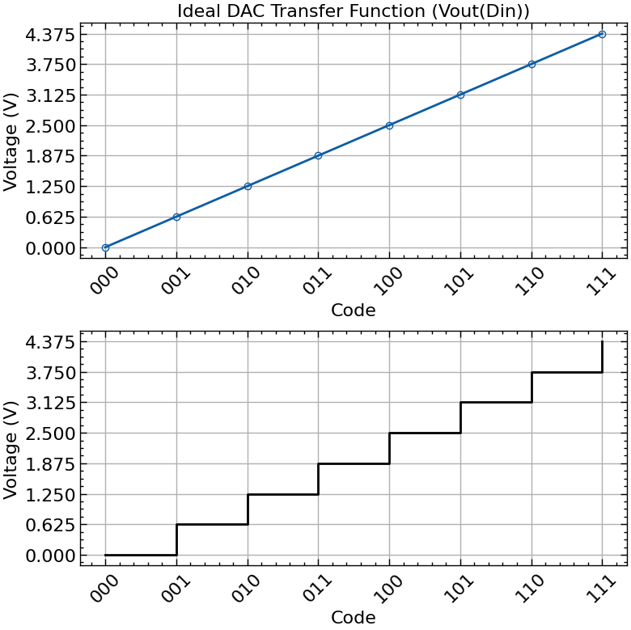
    


## Analog-to-Digital Converter Modelling

<p align="justify"> 
This section presents the definition of the ideal model for the 
transfer function of a ADC. The corresponding transfer function 
that is implemented through a lambda programming style can be observed
in (2). Once again, there are other possible solutions, such as using an 
object-oriented programming approach by defining a DAC object with 
a "convert" method.
</p>

$$D_{OUT}(V_{in}, f_{Round}) = base_2\{f_{Round}(V_{in}/V_{LSB})\} \hspace{10 pt} (2)$$

where $V_{in}$ is the input voltage of the ADC, $V_{LSB}$ is the Least Significant Bit step voltage and $D_{OUT}$ is the output digital code of the ADC. $f_{Round}$ is the rounding function that the ADC implements in practice, and this function can be one of three possible solutions: 
<ul>
<li>a) round(.), rounding to the nearest decimal;</li> 
<li>b) ceil(.), rounding to the highest decimal;</li> 
<li>c) floor(.), rounding to the lowest decimal.</li>
</ul>

<p align="justify">
In this case, equation (2) defines an ADC transfer function that returns the output code in the form of a binary digital word, to provide consistency with the presented code below. It is important to note that the the rounding function is parsed as an input to the 
ADC's transfer function for practical, low-code purposes.
</p>


```python
# modelling an ideal ADC
vref = 5 # V
n_bits = 3 # bits
def ideal_adc(vref:float, nbits:int, roundf):
    """Define the transfer function of an ideal 
    ADC biased by vref and presenting an n_bits resolution.
    Parameters:
        vref (float): The biasing voltage of the electronic system.
        n_bits (int): The resolution of the DAC.
        roundf (function): The rounding function to be used.
    Returns:
        function(Vin): the lambda function defining the transfer function of the ADC
    """
    assert roundf in [np.round, np.ceil, np.floor], "The round function must be numpy.floor, numpy.ceil or numpy.round"
    vlsb = vref/(2**nbits)
    return lambda x: dec2bin(roundf(x/vlsb).astype(int), nbits)
```


```python
iadc = ideal_adc(vref, n_bits, np.round)
iadc_ceil = ideal_adc(vref, n_bits, np.ceil)
iadc_floor = ideal_adc(vref, n_bits, np.floor)
print(iadc(np.array([0,1,2,3,4])))
x = np.arange(0, vref,vref/2**n_bits)
y = iadc(x)
y_str = [ "".join([str(num) for num in yv]) for yv in y]
print(y_str)
fig, ax = plt.subplots(2,1, figsize=(8,8))
ax[0].plot(x, y_str, marker="o", color="k", mfc="None")
ax[0].set_xticks(x)
ax[0].set_xticklabels(x, rotation=45)
ax[0].set_xlabel('Voltage (V)')
ax[0].set_ylabel('Code')
ax[1].step(x, y_str, marker="None", color="k", label="round", where="mid")
y = iadc_ceil(x)
y_str = [ "".join([str(num) for num in yv]) for yv in y]
ax[1].step(x, y_str, marker="None", color="r", label="ceil", where="post")
ax[1].set_xticks(x)
ax[1].set_xticklabels(x, rotation=45)
ax[1].set_xlabel('Voltage (V)')
ax[1].set_ylabel('Code')
y = iadc_floor(x)
y_str = [ "".join([str(num) for num in yv]) for yv in y]
ax[1].step(x, y_str, marker="None", color="b", label="floor", where="pre")
ax[1].set_xticks(x)
ax[1].set_xticklabels(x, rotation=45)
ax[1].set_xlabel('Voltage (V)')
ax[1].set_ylabel('Code')

ax[0].set_xlim([0, vref])
ax[1].set_xlim([0, vref])
fig.tight_layout()
ax[0].set_title("Dout(Vin)")
ax[0].grid(True)
ax[1].grid(True)
ax[1].legend()
fig.tight_layout()
```

    [[0 0 0]
     [0 1 0]
     [0 1 1]
     [1 0 1]
     [1 1 0]]
    ['000', '001', '010', '011', '100', '101', '110', '111']


    
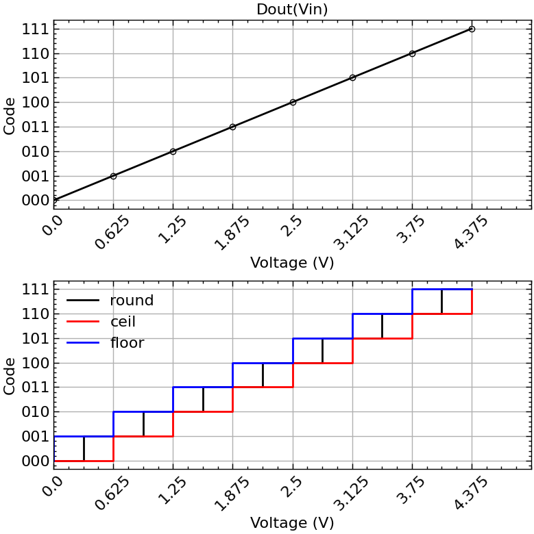

---
    
# Linear and Non-linear Errors in DACs and ADCs

<p align="justify">
The introduction of quantization noise in the ADC or DAC introduces errors 
associated with the quantization step size defining the true characteristic 
of the ADC or DAC transfer function. This notebook presents the modelling and 
study of the two main types of errors in converters: linear and non-linear.
</p>


```python
# mathematical computing
import numpy as np
from scipy import signal # to generate the noise signal
import seaborn as sns # to observe the noise signal's histogram
from numpy.random import uniform, normal # random numbers fitted into a uniform distribution
# plotting
import matplotlib.pyplot as plt
# import the models and utilities functions
from utils import ideal_dac, ideal_adc, nonideal_adc, dec2bin, bin2dec

import scienceplots

plt.style.use(['science', 'notebook'])
```

## DAC Errors Modelling

### DAC Linear Errors

<p align="justify"> 
This section presents the modelling of the linear errors that arise when modelling the transfer function of a DAC. These errors relate to a deviation of the real transfer function of the DAC towards the ideal DAC's transfer function, in which each step size is exactly the same height!
</p>


```python
# define the DAC 
vref = 1.0 # define the reference voltage [V]
n_bits = 5 # define the number of bits of the DAC
vlsb = vref/(2**n_bits) # compute the fundamental step voltage between quantized levels
# define an ideal DAC to compare the results
idac = ideal_dac(vref, n_bits)
# define a DAC with offset error
voff = 0.05
dac_off = lambda x: idac(x) + voff
# define a DAC with end of scale error
# note that the end of scale error 
# is actually directly related to
# the gain error of the DAC
gain_err = -0.1
target_gain = 1.0 + gain_err
dac_eos = lambda x: idac(x)*target_gain
# define a DAC with offset and end of scale error
# to measure the true DAC gain error
dac_off_eos = lambda x: idac(x)*target_gain + voff
# define the input codes of the 3 DACs
din = np.arange(2**n_bits)
# convert the decimals to input binary words
dinb = dec2bin(din, n_bits)
# create the string representation of the input codes
dinb_str = [ "".join([str(num) for num in xv]) for xv in dinb]
# compute the output voltages of the 3 DACs
vout = idac(dinb)
vout_off = dac_off(dinb)
vout_eos = dac_eos(dinb)
vout_off_eos = dac_off_eos(dinb)
```

<p align="justify">
To accurately measure the linear error of DACs it is only necessary to observe the initial and final points of the transfer function. From these points three measurements can be performed:
<ul>
<li>Offset Error, represented in Eq.(1)</li>
<li>End of Scale Error, represented in Eq.(2)</li>
<li>Gain Error, represented in Eq.(3)</li>
</ul>

The Gain Error of the DAC is directly related to both the End of Scale and Offset Errors of the DAC and is derived from them. The errors are measured in LSB units.
</p>

$$\epsilon_{OFF} = \frac{V_{OUT}'[T_0] - V_{OUT}[T_0]}{V_{LSB}} \hspace{4 pt} [LSB] \hspace{10 pt} (1)$$

$$\epsilon_{EOS} = \frac{V_{OUT}'[T_{2^N - 1}] - V_{OUT}[T_{2^N - 1}]}{V_{LSB}} \hspace{4 pt} [LSB] \hspace{10 pt} (2)$$

$$GER_{[\%]} = \left(\frac{V_{OUT}'[T_{2^N - 1}] - V_{OUT}'[T_{0}]}{V_{OUT}[T_{2^N - 1}] - V_{OUT}[T_{0}]} - 1\right)\times100 \hspace{10 pt} (3)$$

where $V_{OUT}[T_i]$ and $V_{OUT}'[T_i]$ is the output voltage of the ideal DAC and real DAC at the $i^{th}$ transition, respectively.


```python
# measure the DAC errors
eoff = (vout_off_eos[0] - vout[0])/vlsb
eeos = (vout_off_eos[2**n_bits - 1] - vout[2**n_bits - 1])/vlsb
ger_pct = ((vout_off_eos[2**n_bits - 1] - vout_off_eos[0])/(vout[2**n_bits - 1] - vout[0]) - 1)*100
print("The offset error is {:.2f} LSB".format(eoff))
print("The end of scale error is {:.2f} LSB".format(eeos))
print("The gain error is {:.2f} %".format(ger_pct))
```

    The offset error is 1.60 LSB
    The end of scale error is -1.50 LSB
    The gain error is -10.00 %


```python
# plot the results
fig, ax = plt.subplots(1, 1, figsize=(10, 8))
ax.plot(din,vout, label="Ideal DAC", marker="None", mfc="None", color="k")
ax.step(din,vout_off, where="post", label="DAC w/ offset error")
ax.step(din,vout_eos, where="post", label="DAC w/ end of scale error")
ax.step(din,vout_off_eos, where="post", label="DAC w/ offset & end of scale error")
ax.set_xlabel("Input code")
ax.set_ylabel("Output voltage [V]")
#ax.set_xticks(din)
#ax.set_xticklabels(dinb_str, rotation=45)
ax.grid(True)
ax.set_title("DAC Transfer Function")
ax.legend(fontsize=14, fancybox=False, frameon=False)
# annotate the DAC errors on the plot
ax.annotate(r"$\epsilon_{OFF}$: "+"{:.2f} LSB".format(eoff), xy=(0, vout_off_eos[0]), xytext=(0, vout_off_eos[0] - 0.1), arrowprops=dict(arrowstyle="->"), fontsize=12)
ax.annotate(r"$\epsilon_{EOS}$: "+"{:.2f} LSB".format(eeos), xy=(2**n_bits - 1, vout_off_eos[2**n_bits - 1]), xytext=(2**n_bits - 1, vout_off_eos[2**n_bits - 1] + 0.1), arrowprops=dict(arrowstyle="->"), fontsize=12)
# add an arrow showing the difference between the ideal DAC and the DAC with offset and end of scale error
ax.annotate("Gain error: {:.2f} %".format(ger_pct), xy=(0,0), xytext=(2**n_bits - 15, 0), fontsize=12)
fig.tight_layout()
```


    
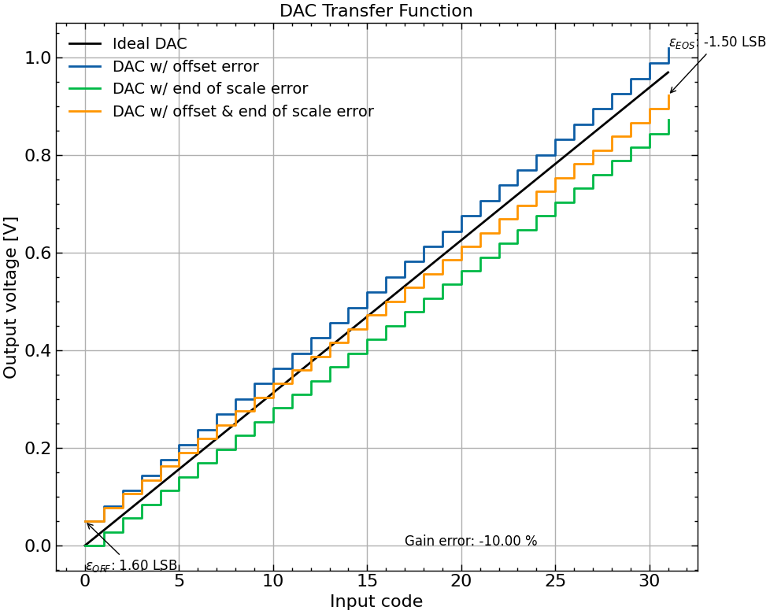
    


### DAC Non-Linear Errors

<p align="justify"> 
This section presents the modelling of the non-linear errors that arise when modelling the transfer function of a DAC. These errors relate to a deviation of the real transfer function of the DAC towards the ideal DAC's transfer function, in which each step size can differ in height due to the inherent non-linearity that arises when quantizing a noisy signal!
</p>


```python
# define the DAC 
vref = 1.0 # define the reference voltage [V]
n_bits = 4 # define the number of bits of the DAC
vlsb = vref/(2**n_bits) # compute the fundamental step voltage between quantized levels
# define an ideal DAC to compare the results
idac = ideal_dac(vref, n_bits)
# define the noise signal with a uniform distribution
vq_var = (vlsb**2)/12
vq_std_dev = np.sqrt(vq_var)
noise_factor=2
dac_nonlinear = lambda x: idac(x) + noise_factor*uniform(-vq_std_dev, vq_std_dev, len(x))
#dac_nonlinear = lambda x: idac(x) + normal(loc=0, scale=vq_std_dev, size=len(x))
# define the input codes of the DAC
din = np.arange(2**n_bits)
# convert the decimals to input binary words
dinb = dec2bin(din, n_bits)
# create the string representation of the input codes
dinb_str = [ "".join([str(num) for num in xv]) for xv in dinb]
# compute the output voltages of the DAC
vout = idac(dinb)
vout_nonlinear = dac_nonlinear(dinb)
```


```python
# plot the results
fig, ax = plt.subplots(1, 1, figsize=(10, 5))
ax.plot(din,vout, label="Ideal DAC", marker="None", mfc="None", color="k")
#ax.step(din,vout, where="post", label="Ideal DAC", color="b")
ax.step(din,vout_nonlinear, where="post", label="Non-Linear DAC", color="r")
ax.set_xticks(din)
ax.set_yticks(np.arange(0, vref + vlsb, vlsb))
ax.set_xlabel("Input code")
ax.set_ylabel("Output voltage [V]")
ax.set_title("DAC Transfer Function")
ax.legend(fontsize=14, fancybox=False, frameon=False)
ax.grid(True)
fig.tight_layout()
```


    
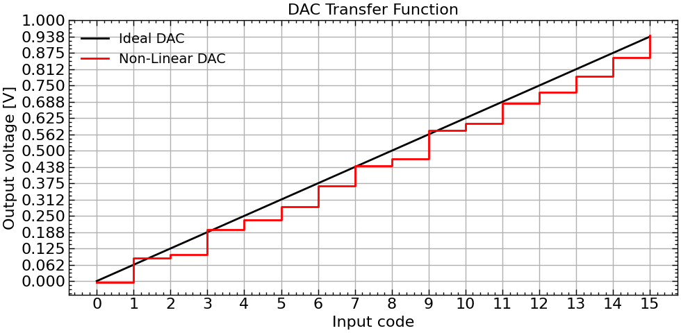
    


<p align="justify">
As it is possible to observe, the exagerated transfer function non-linearities represented in the plot above feature variable output voltages for the non-ideal DAC, due to the quantization noise. The noise was multiplied by an amplification factor to better observe the effect of the quantization noise in the non-linear behaviour of the DAC's transfer function.
</p>

<p align="justify">
The non-linear errors of converters can come in two forms:
<ul>
<li>Differential Non-Linearity (DNL), given in Eq.(5),</li>
<li>Integral Non-Linearity (INL), given in Eq.(6).</li>
</ul>

The DNL and INL are measured in LSB units. The DNL provides a method of locally observing how much each step size changes in each transition. The INL on the other hand is the accumulation of the DNL up until the respective transition, and enables the measurement of the global step-size variability throughout every transition of the transfer function. In DACs, the INL and DNL, as well as any other kind of error, are measured in the vertical axis, where the voltage unit is. Eq. (4) presents the actual measured least significant bit step voltage of the DAC.
</p>

$$ V_{LSB}' = \frac{V_{OUT}'[2^N - 1] - V_{OUT}'[0]}{2^N - 1} \hspace{4 pt} [V] \hspace{10 pt} (4)$$

$$ DNL[n] = \frac{V_{OUT}'[n+1] - V_{OUT}'[n]}{V_{LSB}'} \hspace{4 pt} [LSB], n\in [0, 2^N-2] \hspace{10 pt} (5) $$

$$ INL[n] = \frac{V_{OUT}'[n] - n\times V_{LSB}' - V_{OUT}'[0]}{V_{LSB}'} \hspace{4 pt} [LSB], n\in [0, 2^N-1] \hspace{10 pt} (6) $$

where $V_{OUT}'[n]$ is the output voltage of the real DAC at the $n^{th}$ transition and $V_{LSB}'$ is the measured step size of the non-ideal DAC.

<p align="justify">
<b>NOTE:</b> The INL and DNL can only be calculated after removing the linear error sources (offset, and gain errors).
</p>


```python
# measure the real vlsb
vlsb_measured = (vout_nonlinear[2**n_bits - 1] - vout_nonlinear[0])/(2**n_bits - 1)
print("The ideal vlsb is "+"{:.4f} V".format(vlsb))
print("The measured vlsb is "+"{:.4f} V".format(vlsb_measured))
# measure the DNL of the DAC
dnl = (vout_nonlinear[1::] - vout_nonlinear[0:-1])/vlsb_measured - 1
dnl_pythonic = np.diff(vout_nonlinear)/vlsb_measured - 1
assert np.allclose(dnl, dnl_pythonic), "The DNL two methods give different results"
# assert that n is in [0, 2**n_bits-2] for the DNL
assert len(dnl) == 2**n_bits - 1, "The DNL has a wrong length"
idx = np.arange(2**n_bits)
inl = (vout_nonlinear - idx*vlsb_measured - vout_nonlinear[0])/vlsb_measured
# assert that n is in [0, 2**n_bits-1] for the INL
assert len(inl) == 2**n_bits, "The INL has a wrong length"
# plot the results
fig, ax = plt.subplots(2, 1, figsize=(10, 5))
ax[0].plot(din[1::], dnl, label="DNL", marker="None", mfc="None", color="k")
ax[1].plot(din, inl, label="INL", marker="None", mfc="None", color="r")
ax[0].set_xlabel("Input code")
ax[1].set_xlabel("Input code")
ax[0].set_ylabel("DNL")
ax[1].set_ylabel("INL")
ax[0].set_title("DAC Non-Linearity")
ax[0].grid(True)
ax[1].grid(True)
fig.tight_layout()
fig.legend(fancybox=False, frameon=False, fontsize=8)
```

    The ideal vlsb is 0.0625 V
    The measured vlsb is 0.0632 V


    <matplotlib.legend.Legend at 0x134f82090>


    
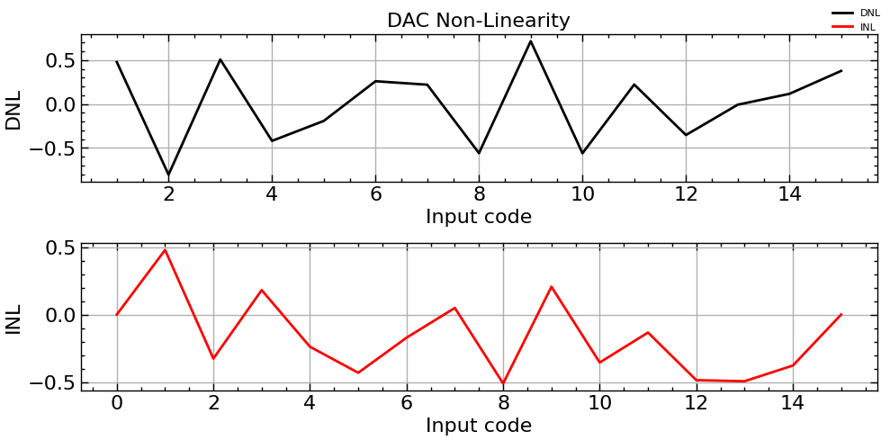
    


## ADC Error Modelling  

### ADC Linear Errors  

<p align="justify"> 
This section presents the modelling of the linear errors that arise when modelling the transfer function of a ADC. These errors relate to a deviation of the real transfer function of the ADC towards the ideal ADC's transfer function, in which each step size is exactly the same width!
It is important to note that in this case (ADC), it is the transition voltlallges of the ADC that deviate from ideal ones, without ever changing step size!
</p>


```python
# define the ADC 
vref = 1.0 # define the reference voltage [V]
n_bits = 4 # define the number of bits of the DAC
vlsb = vref/(2**n_bits) # compute the fundamental step voltage between quantized levels
# define an ideal DAC to compare the results
roundf = np.round
iadc = ideal_adc(vref, n_bits, roundf)
# define the non-ideal ADC with linear errors
# to procees with this step, we need to define 
# an ADC modelling function that is closer to the 
# its physical implementation - the model should include
# the transition voltages as a characteristic parameter
# and the input voltage will only provoke a transition
# if the input voltage is greater than the corresponding
# transition voltage
# define an ADC with offset error
voff = 0.05
adc_off, vt_off = nonideal_adc(vref, n_bits, roundf=roundf, ofst=voff)
# define a ADC with end of scale error
# note that the end of scale error 
# is actually directly related to
# the gain error of the ADC

# The gain error of the ADC is directly related to the
# VREF voltage variation of the ADC. The lower the VREF
# the lower will be vlsb, and as such, the higher will be 
# the end of scale error once the gain decreases. The 
# reciprocal is also true, the higher the VREF the higher
# will be the Vlsb, and as such, the higher will be the
# the gain of the ADC.
vref_err = -0.05 # -5% Vref variation
true_vref = (1 + vref_err)*vref
adc_eos, vt_eos = nonideal_adc(
    true_vref, n_bits, roundf=roundf)
# define a DAC with offset and end of scale error
# to measure the true DAC gain error
adc_off_eos, vt_off_eos = nonideal_adc(
    true_vref, n_bits, roundf=roundf, ofst=voff)
# define the input voltages of the ADC
vin = np.arange(0, vref, vlsb)
vt_off = np.concatenate(([0], vt_off))
vt_eos = np.concatenate(([0], vt_eos))
vt_off_eos = np.concatenate(([0], vt_off_eos))
# create the string representation of the input codes
# compute the output voltages of the 3 DACs
dout = iadc(vin)
dout_off = adc_off(vin)
dout_eos = adc_eos(vin)
dout_off_eos = adc_off_eos(vin)
# convert the output codes to decimals
dout_dec = bin2dec(dout, n_bits)
dout_off_dec = bin2dec(dout_off, n_bits)
dout_eos_dec = bin2dec(dout_eos, n_bits)
dout_off_eos_dec = bin2dec(dout_off_eos, n_bits)
```


```python
# plot the results
fig, ax = plt.subplots(1, 1, figsize=(10, 8))
ax.plot(vin, dout_dec, label="Ideal ADC", marker="None", mfc="None", color="k")
ax.step(vt_off, dout_off_dec,where="post", label="ADC with offset error", color="b")
ax.step(vt_eos, dout_eos_dec, where="post", label="ADC with end of scale error", color="r")
ax.step(vt_off_eos, dout_off_eos_dec, where="post", label="ADC with offset and end of scale error", color="g")
ax.set_xlabel("Input voltage [V]")
ax.set_ylabel("Output code")
ax.set_title("ADC Transfer Function")
ax.legend(fontsize=14, fancybox=False, frameon=False)
ax.grid(True)
fig.tight_layout()
```


    
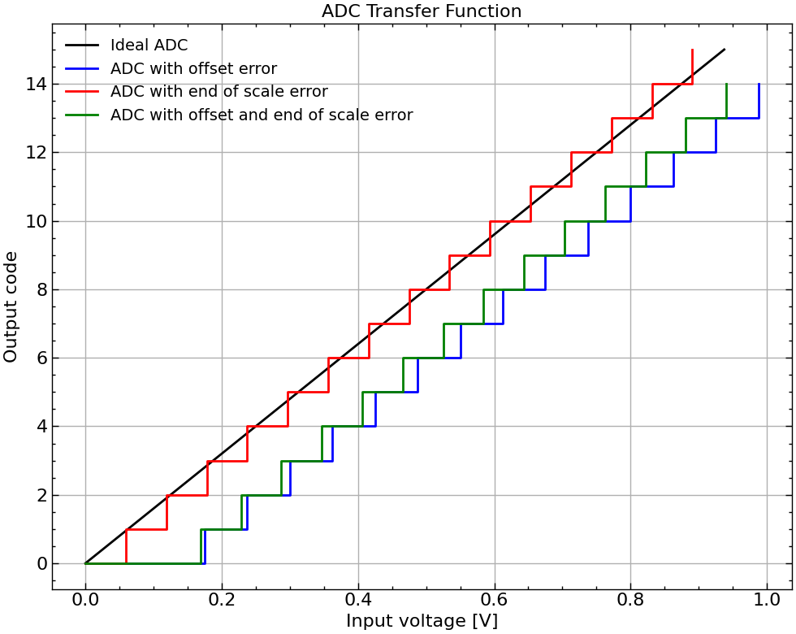
    


```python
# compute linear error ratios
e_off = (vout_off_eos[0] - vin[0])/vlsb
e_eos = (vout_off_eos[-1] - vin[-1])/vlsb
ger_pct = ((vout_off_eos[-1] - vout_off_eos[0])/(vin[-1] - vin[0]) - 1)*100
print("The offset error is "+"{:.2f} LSB".format(e_off))
print("The end of scale error is "+"{:.2f} LSB".format(e_eos))
print("The gain error is "+"{:.2f} %".format(ger_pct))
```

    The offset error is 0.80 LSB
    The end of scale error is -0.25 LSB
    The gain error is -7.00 %


### ADC Non-Linear Errors

<p align="justify"> 
This section presents the modelling of the non-linear errors that arise when modelling the transfer function of a ADC. These errors relate to a deviation of the real transfer function of the ADC towards the ideal ADC's transfer function, in which each step size can differ in width due to the inherent non-linearity that arises when quantizing a noisy signal! In a physical implementation, the intrinsic non-linearities that devices present are usually the main source of non-linear errors in ADCs, directly affecting the position of the transition voltages of the ADC.
</p>


```python
# define the ADC 
vref = 1.0 # define the reference voltage [V]
n_bits = 5 # define the number of bits of the DAC
vlsb = vref/(2**n_bits) # compute the fundamental step voltage between quantized levels
roundf = np.round
# define an ideal DAC to compare the results
iadc = ideal_adc(vref, n_bits, roundf)
# define the noise signal with a uniform distribution
vq_var = (vlsb**2)/12
vq_std_dev = np.sqrt(vq_var)
noise_factor=2
adc_nonlinear, vtrans = nonideal_adc(
    vref, n_bits, roundf=roundf,
    vnq=noise_factor*vq_std_dev)
# define the input voltages of the ADC
vin = np.arange(0, vref, vlsb)
# compute the output codes of the ADC
dout = bin2dec(iadc(vin), n_bits)
dout_nonlinear = bin2dec(adc_nonlinear(vin), n_bits)
```


```python
# plot the results
fig, ax = plt.subplots(1, 1, figsize=(10, 8))
ax.plot(vin, dout, label="Ideal ADC", marker="None", mfc="None", color="k")
ax.step(vin, dout_nonlinear, where="post", label="non-linear ADC", color="r")
ax.set_xlabel("Input voltage [V]")
ax.set_ylabel("Output code")
ax.set_title("ADC Transfer Function")
ax.legend(fontsize=14, fancybox=False, frameon=False)
ax.grid(True)
fig.tight_layout()
```


    
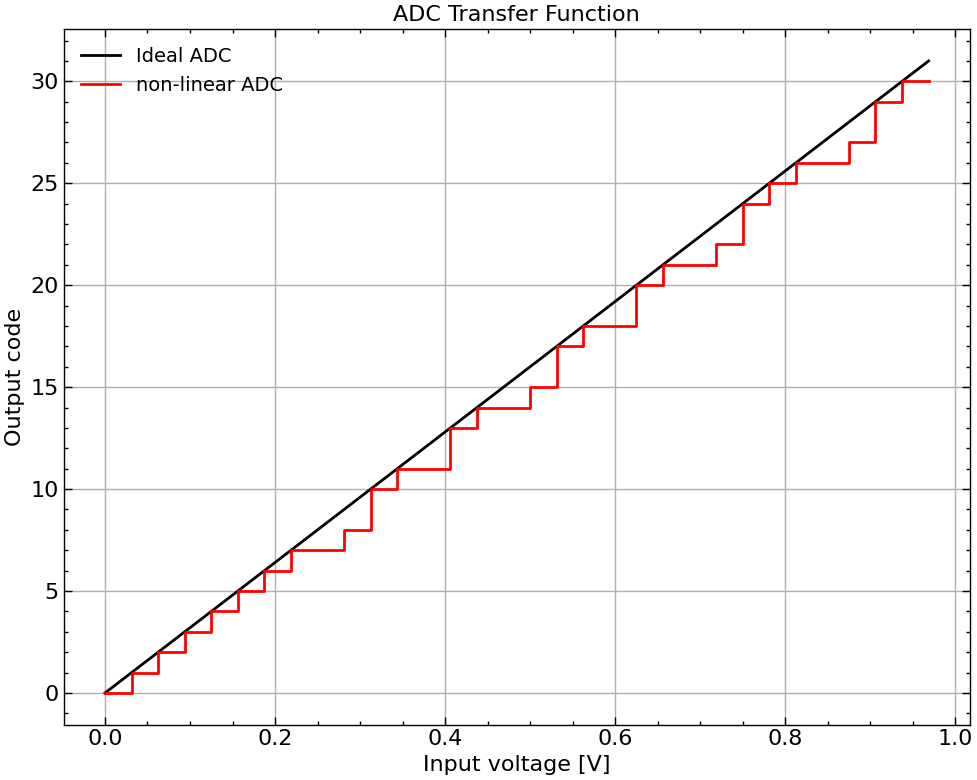
    


<p align="justify">
From both figures observed in this ADC section (2.1 and 2.2),
a very important conclusion can be taken: both linear and non-linear errors can lead to missing codes in the output of the ADC, which eventually leads to a loss of effective resolution of the converter.
</p>

<p align="justify">
Analogously to the DAC section, the non-linear errors of converters can come in two forms:
<ul>
<li>Differential Non-Linearity (DNL), given in Eq.(8),</li>
<li>Integral Non-Linearity (INL), given in Eq.(9).</li>
</ul>

The DNL and INL are measured in LSB units. The DNL provides a method of locally observing how much each step size changes in each transition voltage. The INL on the other hand is the accumulation of the DNL up until the respective transition, and enables the measurement of the global transition voltage step-size variability throughout every transition of the transfer function. In ADCs, the INL and DNL, as well as any other kind of error, are measured in the horizontal axis, where the voltage unit is. Eq. (7) presents the actual measured least significant bit step voltage of the ADC.
</p>

$$ V_{LSB}' = \frac{V_{T}'[2^N - 1] - V_{T}'[1]}{2^N - 2} \hspace{4 pt} [V] \hspace{10 pt} (7)$$

$$ DNL[n] = \frac{V_{T}'[n+1] - V_{T}'[n]}{V_{LSB}'} \hspace{4 pt} [LSB], n\in [0, 2^N-3] \hspace{10 pt} (8) $$

$$ INL[n] = \frac{V_{T}'[n] - n\times V_{LSB}' - V_{T}'[1]}{V_{LSB}'} \hspace{4 pt} [LSB], n\in [0, 2^N-2] \hspace{10 pt} (9) $$

where $V_{T}'[n]$ is the transition voltage level of the real ADC at the $n^{th}$ transition and $V_{LSB}'$ is the measured least significant bit step size of the non-ideal ADC.

In this case (ADC), there are $2^N$ intervals, but only $2^N - 1$ transition voltages, whereas in the DAC case there are $2^N$ intervals and $2^N$ output voltages

<p align="justify">
<b>NOTE:</b> The INL and DNL can only be calculated after removing the linear error sources (offset, and gain errors).
</p>


```python
# compute the non linearity of the ADC
# compute the measured vlsb
assert len(vtrans) == 2**n_bits - 1
vlsb_measured = (vtrans[-1] - vtrans[0])/(len(vtrans)-1)
print("The ideal vlsb is "+"{:.4f} V".format(vlsb))
print("The measured vlsb is "+"{:.4f} V".format(vlsb_measured))
# compute the DNL
dnl = np.diff(vtrans)/vlsb_measured - 1
# assert that n is in [0, 2**n_bits-3] for the DNL
assert len(dnl) == 2**n_bits - 2, "The number of DNL values is not correct"
# compute the INL
idx = np.arange(0, len(vtrans), 1)
inl = (vtrans - idx*vlsb_measured - vtrans[0])/vlsb_measured
# assert that n is in [0, 2**n_bits-2] for the INL
assert len(inl) == 2**n_bits - 1, "The number of INL values is not correct"
```

    The ideal vlsb is 0.0312 V
    The measured vlsb is 0.0319 V


```python
codes = np.arange(1, len(vtrans), 1) # define the DNL transition codes
# plot the results
fig, ax = plt.subplots(2, 1, figsize=(10, 5))
ax[0].plot(codes, dnl, label="DNL", marker="None", mfc="None", color="k")
ax[1].plot(idx, inl, label="INL", marker="None", mfc="None", color="r")
ax[0].set_xlabel("Code")
ax[0].set_ylabel("DNL")
ax[1].set_xlabel("Code")
ax[1].set_ylabel("INL")
ax[0].set_title("DNL and INL")
ax[0].legend(fontsize=8, fancybox=False, frameon=False)
ax[1].legend(fontsize=8, fancybox=False, frameon=False)
ax[0].grid(True)
ax[1].grid(True)
fig.tight_layout()
```


    
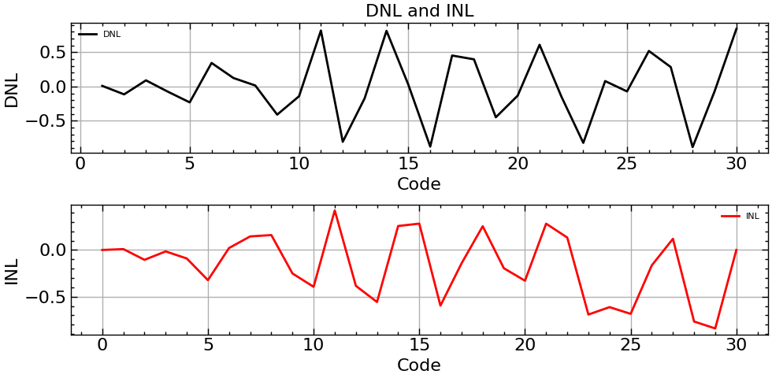
    