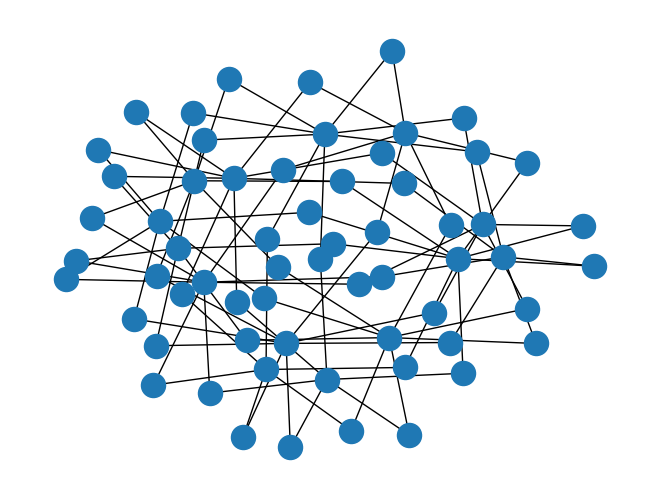
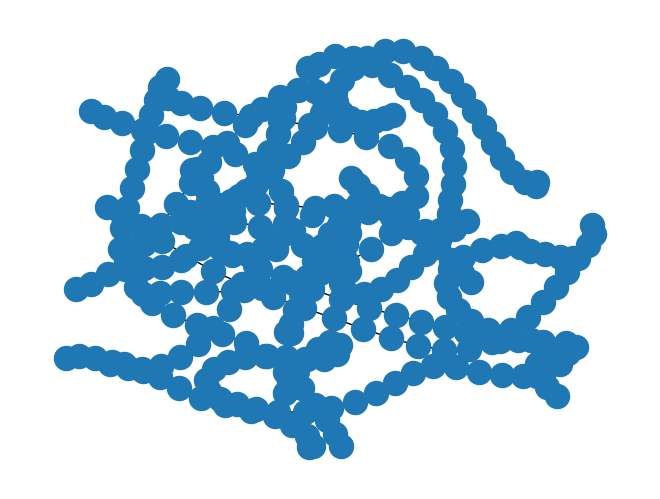
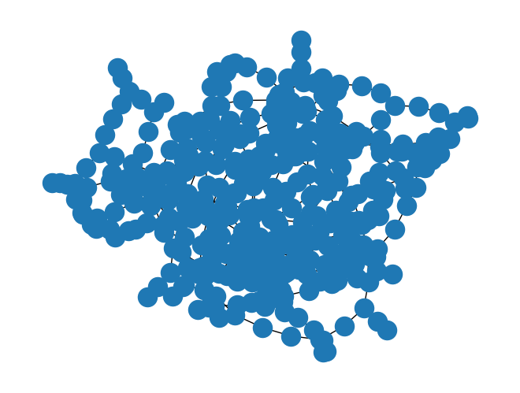
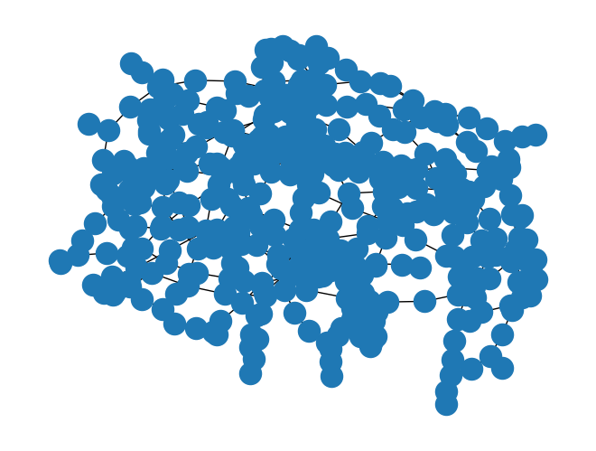

Signoff verification is the final step before sending a chip to manufacturing, ensuring 
that the chip doesn't violate essential physical limitations of the employed PDK. However, 
the required full-chip extraction of IR Drop, current density and parasitics for post-layout simulations are very expensive computationally.

There's been a growing trend on the development of Machine-Learning (ML) assisted signoff tools, shifting the delay it takes to get the results using classical solvers and extractors to a delay during the training phase of the ML-assisted extractor, significantly speeding up the actual signoff simulations using predicted values from the pre-trained regressor and inferece made by the AI-model.

However, for training these models, it is necessary to develop accurate (enough) solvers that generate a user-oriented report (output data of the model) from the input chip GDS information (input data of the model). 

# IR Drop Signoff Tool Example

In the following example, an IR drop extractor is developed using square-counting to measure the resistance-distance between an input PAD of the IC and every-other node of the traced net. This simulation is specially usefull to observe the resistance between the input PAD and every end node of a Power net of the chip - distributing the power to each independant IC of the chip. This verification step is essential to ensure the Power Distribution Net (PDN) is well designed, which becomes a critical verification step in power (HV) ASICs.


```python
%%file requirements.txt
numpy
networkx
gdstk
plotly
ipyvolume
networkx
tqdm
jupyter
nbconvert
nbformat
scipy
```
    Overwriting requirements.txt


```python
%pip install -r requirements.txt
```

Filter out important drawing layers


```python
layers = {
    (2,0): ("met1", "drawing", "metal 1"),
    (2,1): ("via", "via", "metal 1 to metal 2 via"),
    (3,0): ("met2", "drawing", "metal 2"),
}
```


```python

connect_map = {
    "met1": "via",
    "via": "met2",
}

```


```python
def get_layer_by_name(layers, name):
    for k, v in layers.items():
        if v[0] == name and (v[1] == "drawing" or v[1] == "via"):
            return k
    return None
```


```python
get_layer_by_name(layers, "via")
```


    (2, 1)


Import gds of the test layout


```python
import gdstk
lib = gdstk.read_gds('../data/crossed_metal_slotted_ref_withport.gds')

```


```python
lib.name, lib.top_level()[0].name
```


    ('LIB', 'crossed_metal')


Flatten hierarchy and trace power nets (vss and vdd)


```python
from collections import defaultdict
from itertools import chain
from tqdm import tqdm

top_cell = lib.top_level()[0]
new_cell = gdstk.Cell(top_cell.name)

for layer in tqdm(layers.keys()):
  layer_polys = top_cell.get_polygons(layer=layer[0], datatype=layer[1], depth=3, include_paths=True)
  united_layer = gdstk.boolean(layer_polys, layer_polys, "or", layer=layer[0], datatype=layer[1])
  [new_cell.add(pol) for pol in united_layer]
```

    100%|██████████| 3/3 [00:00<00:00, 2727.12it/s]


```python
def intersects(op1, op2):
  result = gdstk.boolean(op1, op2, "and", layer=0, datatype=0)
  return result != [] and result != None
```


```python
import networkx as nx
import numpy as np

connectivity_graph = nx.Graph()
#extract polygon connectivity graph

for bot_layer in tqdm(list(connect_map.keys())):
  top_layer = connect_map[bot_layer]
  top_ld = get_layer_by_name(layers, top_layer)
  bot_ld = get_layer_by_name(layers, bot_layer)
  bot_polys = new_cell.get_polygons(layer=bot_ld[0], datatype=bot_ld[1], depth=-1, include_paths=True)
  top_polys = new_cell.get_polygons(layer=top_ld[0], datatype=top_ld[1], depth=-1, include_paths=True)
  for j, bot_poly in enumerate(bot_polys):
    for k, top_poly in enumerate(top_polys):
      if intersects(bot_poly, top_poly):
        n1 = (*bot_ld, j)
        n2 = (*top_ld, k)
        connectivity_graph.add_edge(n1, n2)

sub_graphs = np.array(list(nx.connected_components(connectivity_graph)))
sub_graph_lens = np.array([len(sg) for sg in sub_graphs])
net_graphs = [
  connectivity_graph.subgraph(sg) for sg in sub_graphs[np.argsort(sub_graph_lens)][::-1]
]
```

      0%|          | 0/2 [00:00<?, ?it/s]

    100%|██████████| 2/2 [00:00<00:00, 167.14it/s]


```python
len(net_graphs), nx.draw(net_graphs[1])
```


    (2, None)


    

    


Discretize flattened power nets into squares and build a graph of connected neighbouring squares


```python
def check_point_inside_polygon(polygon, point: tuple = (),) -> bool:
    """_summary_
    Checks if a point is inside a polygon
    Args:
        polygon (Polygon): Polygon Set object
        point   (list)      : [x:float, y: float] items list
    Returns:
        bool: returns wether the point is inside the polygon or not
    """
    return gdstk.inside([point], polygon)[0]


def check_polygon_overlap(
    polygonA, polygonB, layer: int = 0, datatype: int = 0, precision=1e-3,
) -> list:
    """_summary_
    Checks if two polygons overlap, and
    returns the overlapping region, in case they do
    Args:
        polygonA (Polygon): Polygon object
        polygonB (Polygon): Polygon object
        layer    (int)       : layer of the resulting polygon from the boolean operation
        dataType (int)       : datatype of the resulting polygon from the boolean operation
        precision(float)     : precision of the cuts
    """
    polyList = gdstk.boolean(
        polygonA, polygonB, "and", layer=layer, datatype=datatype, precision=precision
    )
    return polyList if len(polyList) > 0 else None


def bool_polygon_overlap_check(polygonA, polygonB) -> bool:
    """_summary_
    Performs a boolean check
    to infer if the two polygons overlap
    Args:
        polygonA (Polygon): Polygon object
        polygonB (Polygon): Polygon object
    Returns:
        bool:   returns wether the two polygons overlap or not
                True: They overlap; False: They don't overlap
    """
    return check_polygon_overlap(polygonA, polygonB) is not None


def check_neighbour_polygons(poly_a, poly_b) -> bool:
    """_summary_
    Checks if the two polygons have common edges and don't overlap!
    Args:
        polygonA (Polygon): Polygon object
        polygonB (Polygon): Polygon object
    Returns:
        bool:   returns wether the two polygons have common edges
            True: They are neighbours; False: They aren't neighbours
    """
    
    if poly_a.layer == poly_b.layer and poly_a.datatype == poly_b.datatype:
        return gdstk.any_inside(poly_a.points, poly_b)
    return False


def check_same_polygon(poly_a=None, poly_b=None, precision=1e-3,) -> bool:
    """_summary_
    Checks if two polygons are the same
    Args:
        poly_a       (np.array)  : vertices of the polygon
        poly_b       (np.array)  : vertices of the polygon
        precision   (float)     : precision of the comparison
    Returns:
        bool: returns wether the two polygons are the same or not
                True : They are the same; False: They are not the same
    """

    # check if the layers and datatype are the same
    if poly_a.layer != poly_b.layer:
        return False
    if poly_a.datatype != poly_b.datatype:
        return False
    # check if the interception of the two polygons is equal to both of them, or
    # if the not operation (poly_a - poly_b) and (poly_b - poly_a) is equal to an empty space of points/polygons
    notAB = gdstk.boolean(poly_a, poly_b, "not", precision=precision)
    notBA = gdstk.boolean(poly_b, poly_a, "not", precision=precision)
    return len(notAB) == 0 and len(notBA) == 0


def check_polygon_contains_polygon(poly_a=None, poly_b=None,) -> bool:
    """_summary_
    Checks if polygon A contains polygon B
    Args:
        poly_a       (np.array)  : vertices of the polygon
        poly_b       (np.array)  : vertices of the polygon
        maxPoints   (int)       : maximum number of points inside the polygon
        precision   (float)     : precision of the comparison
    Returns:
        bool: returns wether polygon A contains polygon B or not
                True : polygon A contains polygon B; False: polygon A doesn't contain polygon B
    """
    from functools import partial
    # check if the layers and datatype are the same
    if poly_a.layer != poly_b.layer:
        return False
    if poly_a.datatype != poly_b.datatype:
        return False
    # if the union of the two polygons is equal to the polygon A, then polygon A contains polygon B
    # which is equal to checking if : (poly_a U poly_b) NOT poly_a == 0
    unionAB = gdstk.boolean(
        poly_a, poly_b, "or", layer=poly_a.layer, datatype=poly_a.datatype
    )
    mapFunc = partial(check_same_polygon, poly_b=poly_a)
    mapVecFunc = np.vectorize(mapFunc, otypes=[None], signature="()->()")
    # boolMap = [check_same_polygon(uniAB, poly_a) for uniAB in unionAB]
    boolMap = mapVecFunc(unionAB)
    return np.all(boolMap) or check_same_polygon(poly_a, poly_b)

def fragment_polygon(poly: gdstk.Polygon, precision=1e-3,) -> list:
    """Splits the polygon into a list of rectangular polygons.
    Slices the polygon into multiple rectangular polygons along the y and x axis.
    Args:
        poly        (Polygon)   : the polygon to fragment
        precision   (float)     : the precision to use
    Returns:
        list: the list of polygons resulting from the slicing
    """
    max_points = 5  # maximum of 5 nodes per polygons, to define a rectangle.
    frags = poly.fracture(max_points=max_points, precision=precision)
    # ey = [0,1,0]
    ex = [1.0, 0.0, 0.0]  # x axis unitary vector
    sliced_frags = []
    for p in frags:
        edge1 = (p.points[0], p.points[1])
        vector1 = np.array([edge1[1][0] - edge1[0][0], edge1[1][1] - edge1[0][1], 0])
        length_edge1 = np.sqrt(vector1.dot(vector1))
        edge2 = (p.points[1], p.points[2])
        vector2 = np.array([edge2[1][0] - edge2[0][0], edge2[1][1] - edge2[0][1], 0])
        length_edge2 = np.sqrt(vector2.dot(vector2))
        # check the colinearity of each of the edges with unit abciss vector
        crossprod_vec1 = np.cross(ex, vector1)
        xcol_vec1 = np.sqrt(crossprod_vec1.dot(crossprod_vec1))
        crossprod_vec2 = np.cross(ex, vector2)
        xcol_vec2 = np.sqrt(crossprod_vec2.dot(crossprod_vec2))
        slices = [p]
        cut_pos = None
        if xcol_vec1 > xcol_vec2:
            # compute the slicing points for the polygon along the edge 2 orientation
            if length_edge1 != 0.0 and length_edge2 > 1.0 * length_edge1:
                cut_pos = list(
                    np.sort(
                        np.linspace(
                            edge2[0][0],
                            edge2[1][0],
                            num=int(length_edge2 / length_edge1) + 1,
                        )[1:-1]
                    )
                )
                if len(cut_pos) > 0:
                    slices = gdstk.slice(p, cut_pos, "x", precision=precision)
            elif length_edge2 != 0.0 and length_edge1 > 1.0 * length_edge2:
                cut_pos = list(
                    np.sort(
                        np.linspace(
                            edge1[0][1],
                            edge1[1][1],
                            num=int(length_edge1 / length_edge2) + 1,
                        )[1:-1]
                    )
                )
                if len(cut_pos) > 0:
                    slices = gdstk.slice(p, cut_pos, "y", precision=precision)
        else:  # xcol_vec1 <= xcol_vec2
            if length_edge1 != 0.0 and length_edge2 > 1.0 * length_edge1:
                cut_pos = list(
                    np.sort(
                        np.linspace(
                            edge2[0][1],
                            edge2[1][1],
                            num=int(length_edge2 / length_edge1) + 1,
                        )[1:-1]
                    )
                )
                if len(cut_pos) > 0:
                    slices = gdstk.slice(p, cut_pos, "y", precision=precision)
            elif length_edge2 != 0.0 and length_edge1 > 1.0 * length_edge2:
                cut_pos = list(
                    np.sort(
                        np.linspace(
                            edge1[0][0],
                            edge1[1][0],
                            num=int(length_edge1 / length_edge2) + 1,
                        )[1:-1]
                    )
                )
                if len(cut_pos) > 0:
                    slices = gdstk.slice(p, cut_pos, "x", precision=precision)
        try:  # the polygon was sliced and slices is a list of lists of polygons
            [sliced_frags.append(pol) for subslice in slices for pol in subslice]
        except TypeError as te:  # the polygon was too small to be sliced and slices is a list of polygons
            [sliced_frags.append(pol) for pol in slices]
    return sliced_frags if len(sliced_frags) > 0 else None

```


```python
net = net_graphs[1]

fragmented_net_cell = gdstk.Cell("net1")

poly_dict = {layer: 
  new_cell.get_polygons(layer=layer[0], datatype=layer[1], depth=-1, include_paths=True) for layer in layers}

for node in net.nodes:
  layer = (node[0], node[1])
  idx = node[2]
  layer_props = layers[layer]
  fragmented_net_cell.add(*fragment_polygon(poly_dict[layer][idx]))
  
```

Use Ueng-Sikorski algorithm to obtain the adjacency graph between polygons of the same layer. This algorithm groups the adjacent polygons by checking which different polygons share the same edge using the Ueng-Sikorski method. 
This is done by sorting the edge record and chhecking if two adjacent edge records have the same starting and ending node.

Important note: This algorithm must be adapted to detect intersecting, colinear edges, once intersecting polygons with shared edges of different sizes will not be accounted as neighbours - as they should!


```python
from collections import defaultdict

poly_dict = {layer: 
  fragmented_net_cell.get_polygons(layer=layer[0], datatype=layer[1], depth=-1, include_paths=True) for layer in layers}

# Process only metal layers, not via layers.
metal_layers = [layer for layer in poly_dict if layers[layer][1] not in ["via", "label"]]

vertex_record = []
for layer in metal_layers:
  for j, poly in enumerate(poly_dict[layer]):
    sorted_vertexes = [tuple(v) for v in poly.points]
    sorted_vertexes.sort(key=lambda v: v[1])
    vertex_record.extend([(v, j, layer) for v in sorted_vertexes])

unique_vertexes = list(set([(v, l) for v, _, l in vertex_record]))

edge_record = []
for layer in metal_layers:
  for j, poly in enumerate(poly_dict[layer]):
    indexed_vertexes = [unique_vertexes.index((tuple(v),layer)) for v in poly.points]
    edges = list(zip(indexed_vertexes[:-1], indexed_vertexes[1:])) + [(indexed_vertexes[-1],indexed_vertexes[0])]
    # sort all edges uppon recording them
    edge_record.extend([((max(e), min(e)), j, layer) for e in edges])
    

# go through the edges and establish a connection between polygons 
# that share an edge. Other implementations allow polygons to share a single 
# vertex, but this introduces an higher error in resistance computations using 
# square counting.
net_adjacency_graph = nx.Graph()
adjacency_dict = defaultdict(list)
for edge, polygon_id, layer in edge_record:
  adjacency_dict[(edge, layer)].append((polygon_id, layer))

# add intersecting polygons that have different size edges ... 
# colinearity and intersecting edges are not being verified....
# this is slower but easier for now
for layer in metal_layers:
  cons = [
    net_adjacency_graph.add_edge(*((poly_id, layer), (other_poly_id, layer)))
    for poly_id, poly in enumerate(poly_dict[layer])
    for other_poly_id, other_poly in enumerate(poly_dict[layer])
    if check_neighbour_polygons(poly, other_poly) or intersects(poly, other_poly)
  ]

# remove self loops and duplicate edges
net_adjacency_graph.remove_edges_from(list(nx.selfloop_edges(net_adjacency_graph)))

# record only edges that are shared by at least 2 unique polygons
adjacency_dict = {k: v for k, v in adjacency_dict.items() if len(list(set(v))) > 1}

for unique_edge, unique_polygons in adjacency_dict.items():
  neighbour_polygons = list(zip(unique_polygons, unique_polygons[1:]))
  [net_adjacency_graph.add_edge(*edge) for edge in neighbour_polygons]

```


```python
assert adjacency_dict != {}, "Empty adjacency record"
```


```python
len(net_adjacency_graph.edges), nx.draw(net_adjacency_graph)
```


    (342, None)


    

    


Finally, add the conections between vias and the adjacent polygons in the top and bottom layers (from the top layer to via, and from via to bottom layer)


```python
via_layers = [layer for layer in poly_dict if layers[layer][1] not in ["drawing", "label"]]

for layer in tqdm(via_layers):
  layer_name = layers[layer][0]
  bot_layer_name = [key for key in connect_map if connect_map[key] == layer_name][0]
  top_layer_name = connect_map[layer_name]
  bot_layer = get_layer_by_name(layers, bot_layer_name)
  top_layer = get_layer_by_name(layers, top_layer_name)
  polygons_to_check = [(poly, poly_id, bot_layer) for poly_id, poly in enumerate(poly_dict[bot_layer])]
  polygons_to_check = chain(polygons_to_check, [(poly, poly_id, top_layer) for poly_id, poly in enumerate(poly_dict[top_layer])])
  
  edges = [
    ((via_id, layer), (poly_id, poly_layer)) 
    for poly, poly_id, poly_layer in polygons_to_check
    for via_id, via in enumerate(poly_dict[layer])
    if intersects(poly, via)
  ]
  print(edges)
  edges = list(set(edges))
  [net_adjacency_graph.add_edge(*edge) for edge in edges]
  
```


```python
net_adjacency_graph.edges, nx.draw(net_adjacency_graph), nx.is_connected(net_adjacency_graph)
```


    

    


```python
len(net_adjacency_graph.edges)
```


    438


Next, declare an arbitrary input pad of the traced net. In this case, we are just going to use a random polygon. Then, we redirect all edges of the adjacency graph to span out from the input pad polygon. This operation can be done with a BFS Tree representation of the graph, which preserves self-loops containing parallel resistors, but redirects all edges in the loop to an output (/s) node.

Populate graph with sheet resistance information per layer


```python
technology_resistance = {
  "met1": 1e-3, # sheet resistance per square
  "via": 0.2, # resistance of a single via
  "met2": 1e-3,
  "via2": 0.2,
  "met3": 1e-3,
  "via3": 0.2,
  "met4": 1e-4,
  "via4": 0.1,
  "met5": 1e-4
}
```

Using the Moore-Penrose Pseudo inverse, compute the resistance distance between the input pad to all the remaining nodes of the target net to observe IR drop.


```python
@nx.utils.not_implemented_for("directed")
def resistance_distance(G, nodeA=None, nodeB=None, weight=None, invert_weight=True):
    """Returns the resistance distance between every pair of nodes on graph G.

    The resistance distance between two nodes of a graph is akin to treating
    the graph as a grid of resistors with a resistance equal to the provided
    weight [1]_, [2]_.

    If weight is not provided, then a weight of 1 is used for all edges.

    If two nodes are the same, the resistance distance is zero.

    Parameters
    ----------
    G : NetworkX graph
       A graph

    nodeA : node or None, optional (default=None)
      A node within graph G.
      If None, compute resistance distance using all nodes as source nodes.

    nodeB : node or None, optional (default=None)
      A node within graph G.
      If None, compute resistance distance using all nodes as target nodes.

    weight : string or None, optional (default=None)
       The edge data key used to compute the resistance distance.
       If None, then each edge has weight 1.

    invert_weight : boolean (default=True)
        Proper calculation of resistance distance requires building the
        Laplacian matrix with the reciprocal of the weight. Not required
        if the weight is already inverted. Weight cannot be zero.

    Returns
    -------
    rd : dict or float
       If `nodeA` and `nodeB` are given, resistance distance between `nodeA`
       and `nodeB`. If `nodeA` or `nodeB` is unspecified (the default), a
       dictionary of nodes with resistance distances as the value.

    Raises
    ------
    NetworkXNotImplemented
        If `G` is a directed graph.

    NetworkXError
        If `G` is not connected, or contains no nodes,
        or `nodeA` is not in `G` or `nodeB` is not in `G`.

    Examples
    --------
    >>> G = nx.Graph([(1, 2), (1, 3), (1, 4), (3, 4), (3, 5), (4, 5)])
    >>> round(nx.resistance_distance(G, 1, 3), 10)
    0.625

    Notes
    -----
    The implementation is based on Theorem A in [2]_. Self-loops are ignored.
    Multi-edges are contracted in one edge with weight equal to the harmonic sum of the weights.

    References
    ----------
    .. [1] Wikipedia
       "Resistance distance."
       https://en.wikipedia.org/wiki/Resistance_distance
    .. [2] D. J. Klein and M. Randic.
        Resistance distance.
        J. of Math. Chem. 12:81-95, 1993.
    """
    import numpy as np

    if len(G) == 0:
        raise nx.NetworkXError("Graph G must contain at least one node.")
    if not nx.is_connected(G):
        raise nx.NetworkXError("Graph G must be strongly connected.")
    if nodeA is not None and nodeA not in G:
        raise nx.NetworkXError("Node A is not in graph G.")
    if nodeB is not None and nodeB not in G:
        raise nx.NetworkXError("Node B is not in graph G.")

    G = G.copy()
    node_list = list(G)

    # Invert weights
    if invert_weight and weight is not None:
        if G.is_multigraph():
            for u, v, k, d in G.edges(keys=True, data=True):
                d[weight] = 1 / d[weight]
        else:
            for u, v, d in G.edges(data=True):
                d[weight] = 1 / d[weight]

    # Compute resistance distance using the Moore Penrose Pseudo-inverse 
    # of the Laplacian of the Graph
    # Self-loops are ignored
    L = nx.laplacian_matrix(G, weight=weight).todense()
    Linv = np.linalg.pinv(L, hermitian=True)

    # Return relevant distances
    if nodeA is not None and nodeB is not None:
        i = node_list.index(nodeA)
        j = node_list.index(nodeB)
        return Linv[i, i] + Linv[j, j] - Linv[i, j] - Linv[j, i]

    elif nodeA is not None:
        i = node_list.index(nodeA)
        d = {}
        for n in G:
            j = node_list.index(n)
            d[n] = Linv[i, i] + Linv[j, j] - Linv[i, j] - Linv[j, i]
        return d

    elif nodeB is not None:
        j = node_list.index(nodeB)
        d = {}
        for n in G:
            i = node_list.index(n)
            d[n] = Linv[i, i] + Linv[j, j] - Linv[i, j] - Linv[j, i]
        return d

    else:
        d = {}
        for n in G:
            i = node_list.index(n)
            d[n] = {}
            for n2 in G:
                j = node_list.index(n2)
                d[n][n2] = Linv[i, i] + Linv[j, j] - Linv[i, j] - Linv[j, i]
        return d
```


```python
net_adjacency_graph.nodes
```


    NodeView(((0, (2, 0)), (1, (2, 0)), (24, (2, 0)), (2, (2, 0)), (18, (2, 0)), (3, (2, 0)), (4, (2, 0)), (17, (2, 0)), (5, (2, 0)), (6, (2, 0)), (7, (2, 0)), (19, (2, 0)), (8, (2, 0)), (9, (2, 0)), (10, (2, 0)), (20, (2, 0)), (11, (2, 0)), (12, (2, 0)), (13, (2, 0)), (21, (2, 0)), (14, (2, 0)), (15, (2, 0)), (16, (2, 0)), (22, (2, 0)), (23, (2, 0)), (25, (2, 0)), (26, (2, 0)), (49, (2, 0)), (27, (2, 0)), (43, (2, 0)), (28, (2, 0)), (29, (2, 0)), (42, (2, 0)), (30, (2, 0)), (31, (2, 0)), (32, (2, 0)), (44, (2, 0)), (33, (2, 0)), (34, (2, 0)), (35, (2, 0)), (45, (2, 0)), (36, (2, 0)), (37, (2, 0)), (38, (2, 0)), (46, (2, 0)), (39, (2, 0)), (40, (2, 0)), (41, (2, 0)), (47, (2, 0)), (48, (2, 0)), (50, (2, 0)), (51, (2, 0)), (74, (2, 0)), (52, (2, 0)), (68, (2, 0)), (53, (2, 0)), (54, (2, 0)), (67, (2, 0)), (55, (2, 0)), (56, (2, 0)), (57, (2, 0)), (69, (2, 0)), (58, (2, 0)), (59, (2, 0)), (60, (2, 0)), (70, (2, 0)), (61, (2, 0)), (62, (2, 0)), (63, (2, 0)), (71, (2, 0)), (64, (2, 0)), (65, (2, 0)), (66, (2, 0)), (72, (2, 0)), (73, (2, 0)), (75, (2, 0)), (76, (2, 0)), (99, (2, 0)), (77, (2, 0)), (93, (2, 0)), (78, (2, 0)), (79, (2, 0)), (92, (2, 0)), (80, (2, 0)), (81, (2, 0)), (82, (2, 0)), (94, (2, 0)), (83, (2, 0)), (84, (2, 0)), (85, (2, 0)), (95, (2, 0)), (86, (2, 0)), (87, (2, 0)), (88, (2, 0)), (96, (2, 0)), (89, (2, 0)), (90, (2, 0)), (91, (2, 0)), (97, (2, 0)), (98, (2, 0)), (100, (2, 0)), (101, (2, 0)), (124, (2, 0)), (102, (2, 0)), (118, (2, 0)), (103, (2, 0)), (104, (2, 0)), (117, (2, 0)), (105, (2, 0)), (106, (2, 0)), (107, (2, 0)), (119, (2, 0)), (108, (2, 0)), (109, (2, 0)), (110, (2, 0)), (120, (2, 0)), (111, (2, 0)), (112, (2, 0)), (113, (2, 0)), (121, (2, 0)), (114, (2, 0)), (115, (2, 0)), (116, (2, 0)), (122, (2, 0)), (123, (2, 0)), (125, (2, 0)), (126, (2, 0)), (149, (2, 0)), (127, (2, 0)), (143, (2, 0)), (128, (2, 0)), (129, (2, 0)), (142, (2, 0)), (130, (2, 0)), (131, (2, 0)), (132, (2, 0)), (144, (2, 0)), (133, (2, 0)), (134, (2, 0)), (135, (2, 0)), (145, (2, 0)), (136, (2, 0)), (137, (2, 0)), (138, (2, 0)), (146, (2, 0)), (139, (2, 0)), (140, (2, 0)), (141, (2, 0)), (147, (2, 0)), (148, (2, 0)), (150, (2, 0)), (151, (2, 0)), (174, (2, 0)), (152, (2, 0)), (168, (2, 0)), (153, (2, 0)), (154, (2, 0)), (167, (2, 0)), (155, (2, 0)), (156, (2, 0)), (157, (2, 0)), (169, (2, 0)), (158, (2, 0)), (159, (2, 0)), (160, (2, 0)), (170, (2, 0)), (161, (2, 0)), (162, (2, 0)), (163, (2, 0)), (171, (2, 0)), (164, (2, 0)), (165, (2, 0)), (166, (2, 0)), (172, (2, 0)), (173, (2, 0)), (175, (2, 0)), (176, (2, 0)), (199, (2, 0)), (177, (2, 0)), (193, (2, 0)), (178, (2, 0)), (179, (2, 0)), (192, (2, 0)), (180, (2, 0)), (181, (2, 0)), (182, (2, 0)), (194, (2, 0)), (183, (2, 0)), (184, (2, 0)), (185, (2, 0)), (195, (2, 0)), (186, (2, 0)), (187, (2, 0)), (188, (2, 0)), (196, (2, 0)), (189, (2, 0)), (190, (2, 0)), (191, (2, 0)), (197, (2, 0)), (198, (2, 0)), (0, (3, 0)), (1, (3, 0)), (24, (3, 0)), (17, (3, 0)), (2, (3, 0)), (3, (3, 0)), (16, (3, 0)), (4, (3, 0)), (5, (3, 0)), (18, (3, 0)), (6, (3, 0)), (7, (3, 0)), (19, (3, 0)), (8, (3, 0)), (9, (3, 0)), (20, (3, 0)), (10, (3, 0)), (11, (3, 0)), (21, (3, 0)), (12, (3, 0)), (13, (3, 0)), (22, (3, 0)), (14, (3, 0)), (15, (3, 0)), (23, (3, 0)), (25, (3, 0)), (26, (3, 0)), (49, (3, 0)), (42, (3, 0)), (27, (3, 0)), (28, (3, 0)), (41, (3, 0)), (29, (3, 0)), (30, (3, 0)), (43, (3, 0)), (31, (3, 0)), (32, (3, 0)), (44, (3, 0)), (33, (3, 0)), (34, (3, 0)), (45, (3, 0)), (35, (3, 0)), (36, (3, 0)), (46, (3, 0)), (37, (3, 0)), (38, (3, 0)), (47, (3, 0)), (39, (3, 0)), (40, (3, 0)), (48, (3, 0)), (50, (3, 0)), (51, (3, 0)), (74, (3, 0)), (67, (3, 0)), (52, (3, 0)), (53, (3, 0)), (66, (3, 0)), (54, (3, 0)), (55, (3, 0)), (68, (3, 0)), (56, (3, 0)), (57, (3, 0)), (69, (3, 0)), (58, (3, 0)), (59, (3, 0)), (70, (3, 0)), (60, (3, 0)), (61, (3, 0)), (71, (3, 0)), (62, (3, 0)), (63, (3, 0)), (72, (3, 0)), (64, (3, 0)), (65, (3, 0)), (73, (3, 0)), (75, (3, 0)), (76, (3, 0)), (99, (3, 0)), (92, (3, 0)), (77, (3, 0)), (78, (3, 0)), (91, (3, 0)), (79, (3, 0)), (80, (3, 0)), (93, (3, 0)), (81, (3, 0)), (82, (3, 0)), (94, (3, 0)), (83, (3, 0)), (84, (3, 0)), (95, (3, 0)), (85, (3, 0)), (86, (3, 0)), (96, (3, 0)), (87, (3, 0)), (88, (3, 0)), (97, (3, 0)), (89, (3, 0)), (90, (3, 0)), (98, (3, 0)), (100, (3, 0)), (101, (3, 0)), (124, (3, 0)), (117, (3, 0)), (102, (3, 0)), (103, (3, 0)), (116, (3, 0)), (104, (3, 0)), (105, (3, 0)), (118, (3, 0)), (106, (3, 0)), (107, (3, 0)), (119, (3, 0)), (108, (3, 0)), (109, (3, 0)), (120, (3, 0)), (110, (3, 0)), (111, (3, 0)), (121, (3, 0)), (112, (3, 0)), (113, (3, 0)), (122, (3, 0)), (114, (3, 0)), (115, (3, 0)), (123, (3, 0)), (125, (3, 0)), (126, (3, 0)), (149, (3, 0)), (142, (3, 0)), (127, (3, 0)), (128, (3, 0)), (141, (3, 0)), (129, (3, 0)), (130, (3, 0)), (143, (3, 0)), (131, (3, 0)), (132, (3, 0)), (144, (3, 0)), (133, (3, 0)), (134, (3, 0)), (145, (3, 0)), (135, (3, 0)), (136, (3, 0)), (146, (3, 0)), (137, (3, 0)), (138, (3, 0)), (147, (3, 0)), (139, (3, 0)), (140, (3, 0)), (148, (3, 0)), (2, (2, 1)), (43, (2, 1)), (19, (2, 1)), (12, (2, 1)), (33, (2, 1)), (16, (2, 1)), (30, (2, 1)), (40, (2, 1)), (1, (2, 1)), (38, (2, 1)), (9, (2, 1)), (34, (2, 1)), (37, (2, 1)), (29, (2, 1)), (7, (2, 1)), (27, (2, 1)), (26, (2, 1)), (4, (2, 1)), (6, (2, 1)), (3, (2, 1)), (32, (2, 1)), (22, (2, 1)), (17, (2, 1)), (47, (2, 1)), (18, (2, 1)), (11, (2, 1)), (31, (2, 1)), (42, (2, 1)), (14, (2, 1)), (0, (2, 1)), (46, (2, 1)), (35, (2, 1)), (8, (2, 1)), (28, (2, 1)), (39, (2, 1)), (44, (2, 1)), (21, (2, 1)), (36, (2, 1)), (41, (2, 1)), (15, (2, 1)), (13, (2, 1)), (10, (2, 1)), (20, (2, 1)), (25, (2, 1)), (45, (2, 1)), (5, (2, 1)), (24, (2, 1)), (23, (2, 1))))


```python
source = list(net_adjacency_graph.nodes)[11]
max_nodes = 1000000
net_adj_tree_graph: nx.DiGraph = nx.bfs_tree(
        net_adjacency_graph, 
        source, 
        depth_limit=max_nodes
    )

for edge in net_adj_tree_graph.edges:
  layer = edge[0][1]
  layer_name = layers[layer][0]
  resistance = technology_resistance[layer_name]
  nx.set_edge_attributes(
    net_adj_tree_graph, {edge: resistance}, "edge-resistance"
  )

resistance_map = resistance_distance(
    nx.to_undirected(net_adj_tree_graph), 
    nodeA=source,
    nodeB=None, # target is None to compute the resistance to all nodes
    weight="edge-resistance"
)
# annotate the nodes of the graph with the resistance 
# distance between the source and other nodes
[nx.set_node_attributes(
  net_adj_tree_graph, 
  {node: resistance}, 
  name="node-resistance"
) for node, resistance in resistance_map.items()];

```


```python
nx.draw(net_adjacency_graph)
```


    

    


```python
list(resistance_map.items())[:10]
```


    [((19, (2, 0)), np.float64(0.0)),
     ((7, (2, 0)), np.float64(0.0010000000000000009)),
     ((8, (2, 0)), np.float64(0.0010000000000000148)),
     ((38, (2, 1)), np.float64(0.0009999999999999176)),
     ((6, (2, 0)), np.float64(0.0019999999999998908)),
     ((9, (2, 0)), np.float64(0.002000000000000113)),
     ((122, (3, 0)), np.float64(0.20099999999653825)),
     ((5, (2, 0)), np.float64(0.002999999999999725)),
     ((10, (2, 0)), np.float64(0.0030000000000002663)),
     ((113, (3, 0)), np.float64(0.20199999999651141))]


```python
import matplotlib.cm as cm
import matplotlib.pyplot as plt
jetcmap = cm.jet
jetcmap(0.0)
```


    (np.float64(0.0), np.float64(0.0), np.float64(0.5), np.float64(1.0))


Raster the vectorized traced power net into a 3D stack of 2D images, back-annotaing the IR drop information to the rastered net.


```python
min_pix = 0
max_pix = 2**10
net_bbox = fragmented_net_cell.bounding_box()
dx = net_bbox[1][0] - net_bbox[0][0]
dy = net_bbox[1][1] - net_bbox[0][1]
aspect_ratio = np.abs(dy/dx)
net_domain = ((net_bbox[0][0], net_bbox[1][1]), (net_bbox[1][0], net_bbox[0][1]))
img_domain = ((0, 0), (int(max_pix*aspect_ratio), max_pix))
images = {layer: np.zeros((int(max_pix*aspect_ratio), max_pix)) for layer in poly_dict.keys()}
for layer in poly_dict:
  images[layer][:] = np.nan

MIN_RES = 0.0
MAX_RES = max(list(resistance_map.values()))

def norm_res(r, minr, maxr):
  return np.abs((r - minr)/(maxr - minr))


def paint(color, vector_region, image, vector_domain, img_domain):
  import pdb
  start, end = ((vector_region[0][0], vector_region[1][1]), 
                (vector_region[1][0], vector_region[0][1]))
  
  #start, end = vector_region
  my = (img_domain[1][1] - img_domain[0][1]) / (vector_domain[1][1]-vector_domain[0][1])
  mx = (img_domain[1][0] - img_domain[0][0]) / (vector_domain[1][0]-vector_domain[0][0])
  
  start_x = (start[0] - vector_domain[0][0]) * mx
  start_y = (start[1] - vector_domain[0][1]) * my
  
  end_x = (end[0] - vector_domain[0][0]) * mx
  end_y = (end[1] - vector_domain[0][1]) * my
  
  img_start_y = np.floor(((start_y) + img_domain[0][1])).astype(int)
  img_start_x = np.floor(((start_x) + img_domain[0][0])).astype(int)
  
  img_end_y = np.ceil(((end_y) + img_domain[0][1])).astype(int)
  img_end_x = np.ceil(((end_x) + img_domain[0][0])).astype(int)
  
  image[img_start_y: img_end_y+1, img_start_x: img_end_x+1] = color
  
  return image
  
for node, resistance in resistance_map.items():
  poly_id, layer = node
  poly = poly_dict[layer][poly_id]
  #color = jetcmap(norm_res(resistance, MIN_RES, MAX_RES))
  
  paint(resistance, poly.bounding_box(), images[layer], net_domain, img_domain)
```


```python
import plotly.graph_objects as go

# Stack the 2D images into a 3D array (shape: 10x10x3)
stacked_images_3d = np.stack([images[layer] for layer in images.keys() if layer], axis=-1)

# Get the shape of the images

print(stacked_images_3d.shape)

height, width, depth = stacked_images_3d.shape

# Create meshgrid for x and y coordinates
x = np.arange(0, width)
y = np.arange(0, height)
x, y = np.meshgrid(x, y)

# Create the figure using plotly
fig = go.Figure()

# Plot each slice of the 3D stack as a surface
for i in range(depth):
    # Get the RGB values for the slice at index i
    slice_rgb = stacked_images_3d[:, :, i]
    mask = np.isnan(stacked_images_3d[:, :, i])
    xx = np.where(mask, np.nan, x)
    yy = np.where(mask, np.nan, y)
    
    z=np.zeros_like(x)+i*5
    
    zz = np.where(mask, np.nan, z)
    
    # Plot the surface with RGB values
    fig.add_trace(go.Surface(
        x=xx, y=yy, z=zz,  # Coordinates for the meshgrid (flat on the z-axis)
        surfacecolor=slice_rgb,  # Use RGB colors for the surface
        colorscale='jet',  # Use RGB color scale
        opacity=1.0,
        cmin = MIN_RES,
        cmax = MAX_RES*1.5,
        colorbar={"title": 'IR Drop [V]'}
    ))

# Set the layout for the figure (remove axes and add titles)
fig.update_layout(
    title='IC Layers 3D Stack',
    scene=dict(
        xaxis=dict(showgrid=False, zeroline=False, showticklabels=False),
        yaxis=dict(showgrid=False, zeroline=False, showticklabels=False),
        zaxis=dict(showgrid=False, zeroline=False, showticklabels=False),
    ),
    #margin=dict(t=50, b=50, l=50, r=50),  # Add some margin to avoid clipping
    template = "plotly_dark"
)

# Show the plot
fig.show()
```

    (1044, 1024, 3)


